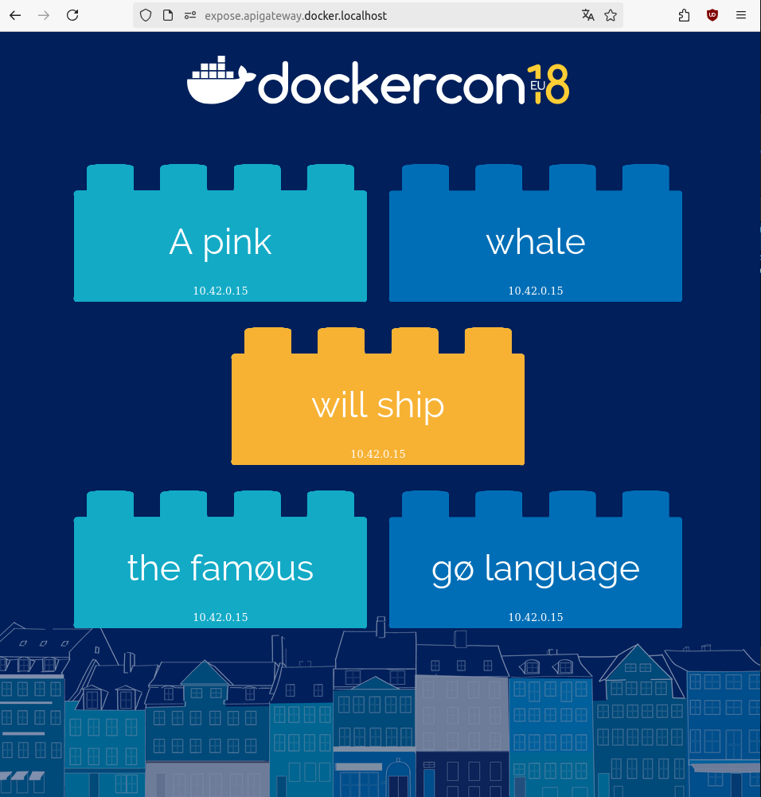
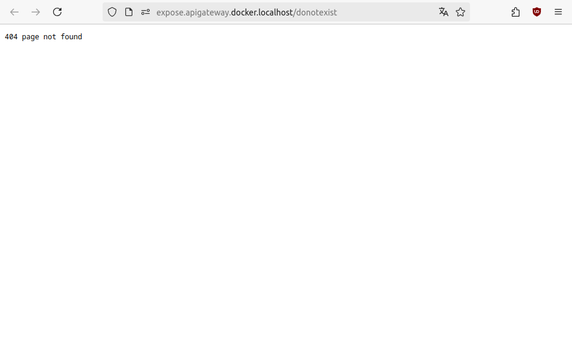
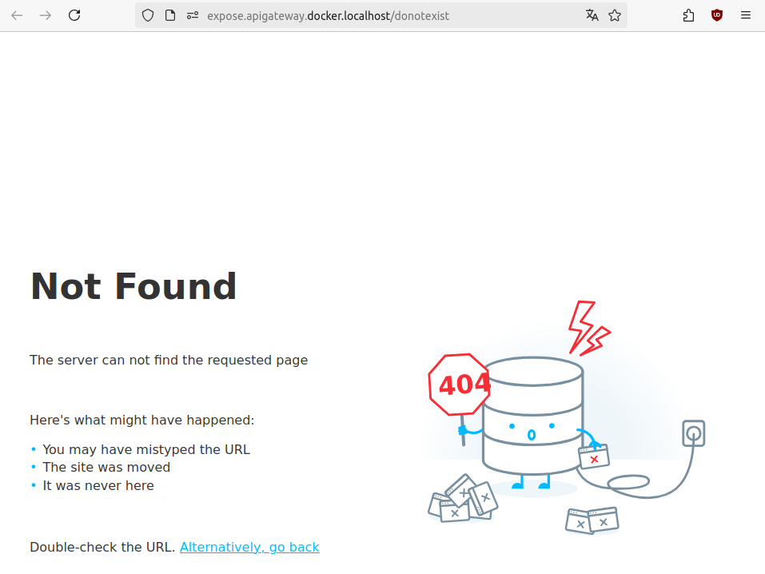
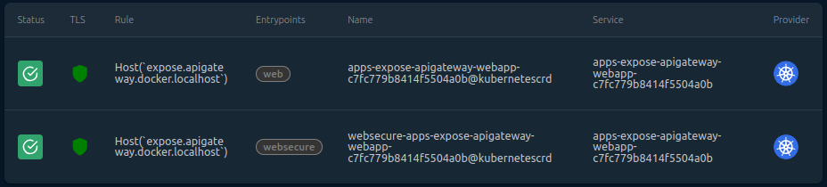
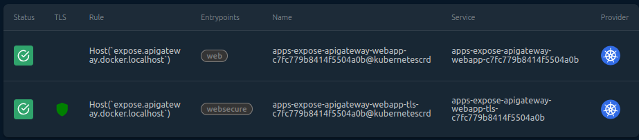

# Expose

As the entry point on your cluster, Traefik Hub API Gateway can be used to expose resources.

We'll see in this tutorial:

1. How to expose an external API
2. How to expose an internal website
3. How to configure HTTPS with CA certificates
4. How to configure HTTPS with an automated CA

:information_source: To follow this tutorial, you must install Traefik Hub following the [getting started](../1-getting-started/README.md) instructions.

## Expose an external API

Traefik Hub is able to handle various API protocols and use cases.

We will expose a GraphQL API to demonstrate that Traefik Hub can manage and secure not only REST APIs but also other types of APIs, such as GraphQL.

We will use the well known [countries](https://github.com/trevorblades/countries) from Trevor Blades.

First, let's see if we can query it:

```sh
curl -s 'https://countries.trevorblades.com/' -X POST \
  -H 'content-type: application/json' \
  --data '{ "query": "{ continents { code name } }" }' | jq
```

```yaml
{
  "data": {
    "continents": [
      {
        "code": "AF",
        "name": "Africa"
      },
      {
        "code": "AN",
        "name": "Antarctica"
      },
      {
        "code": "AS",
        "name": "Asia"
      },
      {
        "code": "EU",
        "name": "Europe"
      },
      {
        "code": "NA",
        "name": "North America"
      },
      {
        "code": "OC",
        "name": "Oceania"
      },
      {
        "code": "SA",
        "name": "South America"
      }
    ]
  }
}
```

In Kubernetes, we can declare this endpoint as an ExternalName `Service`:

```yaml :manifests/graphql-service.yaml
---
apiVersion: v1
kind: Service
metadata:
  name: graphql
  namespace: apps
spec:
  type: ExternalName
  externalName: countries.trevorblades.com
  ports:
    - port: 443
```

Like any other `Service`, it can be exposed on our cluster using an `IngressRoute`:

```yaml :manifests/graphql-ingressroute.yaml
---
apiVersion: traefik.io/v1alpha1
kind: IngressRoute
metadata:
  name: expose-apigateway-graphql
  namespace: apps
spec:
  entryPoints:
    - web
  routes:
  - match: Host(`expose.apigateway.docker.localhost`) && Path(`/graphql`)
    kind: Rule
    services:
    - name: graphql
      port: 443
```

Let's apply it:

```sh
kubectl apply -f src/manifests/apps-namespace.yaml
kubectl apply -f api-gateway/2-expose/manifests/graphql-service.yaml
kubectl apply -f api-gateway/2-expose/manifests/graphql-ingressroute.yaml
```

And test it:

```sh
curl -s 'http://expose.apigateway.docker.localhost/graphql' -X POST \
  -H 'content-type: application/json' \
  --data '{ "query": "{ continents { code name } }" }'
```

```sh
404 page not found
```

It does not work :sob:. Why?
Let's check the Traefik Hub logs:

```sh
kubectl logs -n traefik -l app.kubernetes.io/name=traefik
```

```sh
[...]
2024-10-09T08:02:53Z ERR error="externalName services not allowed: apps/graphql" ingress=expose-apigateway-graphql namespace=apps providerName=kubernetescrd
2024-10-09T08:03:42Z ERR error="externalName services not allowed: apps/graphql" ingress=expose-apigateway-graphql namespace=apps providerName=kubernetescrd
```

For security reasons, since 2021, Traefik has disabled this feature by default. See PR [#8261](https://github.com/traefik/traefik/pull/8261).

We can enable it using helm:

```sh
helm upgrade traefik -n traefik --wait \
  --version v33.0.0 \
  --reuse-values \
  --set providers.kubernetesCRD.allowExternalNameServices=true \
  traefik/traefik
```

Let's test it again:

```sh
curl -s 'http://expose.apigateway.docker.localhost/graphql' -X POST \
  -H 'content-type: application/json' \
  --data '{ "query": "{ continents { code name } }" }'
```

```less
Requested host does not match any Subject Alternative Names (SANs) on TLS certificate [da140de2fae284c9221f5584e2c672f658a41dfb9b627354f6dedad6804fd9d4] in use with this connection.

Visit https://docs.fastly.com/en/guides/common-400-errors#error-421-misdirected-request for more information.
```

There is another error about the Host. :sob: It can be somehow expected;
our `expose.apigateway.docker.localhost` domain is not known by this external service.
Luckily, we can configure the IngressRoute to use upstream domain for the requested host.

Let's update the `IngressRoute`:

```diff :../../hack/diff.sh -r -a "manifests/graphql-ingressroute.yaml manifests/graphql-ingressroute-complete.yaml"
--- manifests/graphql-ingressroute.yaml
+++ manifests/graphql-ingressroute-complete.yaml
@@ -13,3 +13,4 @@
     services:
     - name: graphql
       port: 443
+      passHostHeader: false
```

Let's update the `IngressRoute` and :crossed_fingers: for this test:

```sh
kubectl apply -f api-gateway/2-expose/manifests/graphql-ingressroute-complete.yaml
sleep 1
curl -s 'http://expose.apigateway.docker.localhost/graphql' -X POST \
  -H 'content-type: application/json' \
  --data '{ "query": "{ continents { code name } }" }' | jq
```

```yaml
{
  "data": {
    "continents": [
      {
        "code": "AF",
        "name": "Africa"
      },
      {
        "code": "AN",
        "name": "Antarctica"
      },
      {
        "code": "AS",
        "name": "Asia"
      },
      {
        "code": "EU",
        "name": "Europe"
      },
      {
        "code": "NA",
        "name": "North America"
      },
      {
        "code": "OC",
        "name": "Oceania"
      },
      {
        "code": "SA",
        "name": "South America"
      }
    ]
  }
}
```

It works! :tada: We received the expected answer from the ExternalName `Service`.

Now, let's see how to expose a website.

## Expose a website

In this section, we will use the [wordsmith](https://github.com/dockersamples/wordsmith) sample project from dockersamples.

This project comes with three containers (web, api, db) and expose a web page with dynamic and static content.

Let's deploy it:

```sh
kubectl apply -f api-gateway/2-expose/manifests/webapp-db.yaml
kubectl apply -f api-gateway/2-expose/manifests/webapp-api.yaml
kubectl apply -f api-gateway/2-expose/manifests/webapp-front.yaml
kubectl apply -f api-gateway/2-expose/manifests/webapp-ingressroute.yaml
kubectl wait -n apps --for=condition=ready pod --selector="app in (db,api,web)"
```

We can now access it on http://expose.apigateway.docker.localhost/



### Compress static text content

This website is downloading some javascript file. When trying to download them, we can check if it's using compression easily with curl:

```sh
curl -si -H 'Accept-Encoding: gzip, deflate, bz, zstd'  http://expose.apigateway.docker.localhost/app.js | head -n 4
```

```less
HTTP/1.1 200 OK
Accept-Ranges: bytes
Content-Length: 1183
Content-Type: text/javascript; charset=utf-8
[...]
```

There is no  `Content-Encoding` header, which means there is no compression used.

We can configure it to provide faster download with the Compress `Middleware`.

```diff :../../hack/diff.sh -r -a "manifests/webapp-ingressroute.yaml manifests/webapp-ingressroute-compress.yaml"
--- manifests/webapp-ingressroute.yaml
+++ manifests/webapp-ingressroute-compress.yaml
@@ -1,5 +1,23 @@
 ---
 apiVersion: traefik.io/v1alpha1
+kind: Middleware
+metadata:
+  name: compress
+  namespace: apps
+spec:
+  compress:
+    includedContentTypes:
+      - application/json
+      - application/xml
+      - text/css
+      - text/csv
+      - text/html
+      - text/javascript
+      - text/plain
+      - text/xml
+
+---
+apiVersion: traefik.io/v1alpha1
 kind: IngressRoute
 metadata:
   name: expose-apigateway-webapp
@@ -10,6 +28,8 @@
   routes:
   - match: Host(`expose.apigateway.docker.localhost`)
     kind: Rule
+    middlewares:
+      - name: compress
     services:
     - name: web
       port: 80
```

Let's apply it:

```sh
kubectl apply -f api-gateway/2-expose/manifests/webapp-ingressroute-compress.yaml
```

And test it:

```sh
curl -si -H 'Accept-Encoding: gzip, deflate, bz, zstd'  http://expose.apigateway.docker.localhost/app.js | head -n 4
```

```less
HTTP/1.1 200 OK
Accept-Ranges: bytes
Content-Encoding: zstd
Content-Type: text/javascript; charset=utf-8
```

We can see here the `Content-Encoding` header, letting the recipient know how to decode the body.

### Protect with Security Headers and CORS

Let's see how to use [CORS](https://en.wikipedia.org/wiki/Cross-origin_resource_sharing) to indicate to the browser if an API call from a different origin is allowed.

First, let's check if it's possible to call it from a different origin:

```sh
curl -I -H "Origin: http://test2.com"  http://expose.apigateway.docker.localhost/
```

```less
HTTP/1.1 200 OK
Accept-Ranges: bytes
Content-Length: 1415
Content-Type: text/html; charset=utf-8
```

We can see there are no security or CORS headers. Now, let's protect our sample webapp with Security and CORS headers:

```diff :../../hack/diff.sh -r -a "manifests/webapp-ingressroute-compress.yaml manifests/webapp-ingressroute-cors.yaml"
--- manifests/webapp-ingressroute-compress.yaml
+++ manifests/webapp-ingressroute-cors.yaml
@@ -18,6 +18,27 @@
 
 ---
 apiVersion: traefik.io/v1alpha1
+kind: Middleware
+metadata:
+  name: security-headers
+  namespace: apps
+spec:
+  headers:
+    frameDeny: true
+    browserXssFilter: true
+    contentTypeNosniff: true
+    # HSTS
+    stsIncludeSubdomains: true
+    stsPreload: true
+    stsSeconds: 31536000
+    # CORS
+    accessControlAllowMethods: [ "GET", "OPTIONS" ]
+    accessControlAllowHeaders: [ "*" ]
+    accessControlAllowOriginList: [ "http://test.com" ]
+    accessControlMaxAge: 100
+
+---
+apiVersion: traefik.io/v1alpha1
 kind: IngressRoute
 metadata:
   name: expose-apigateway-webapp
@@ -30,6 +51,7 @@
     kind: Rule
     middlewares:
       - name: compress
+      - name: security-headers
     services:
     - name: web
       port: 80
```

Let's apply it:

```sh
kubectl apply -f api-gateway/2-expose/manifests/webapp-ingressroute-cors.yaml
```

And test it:

```sh
curl -I -H "Origin: http://test.com"  http://expose.apigateway.docker.localhost/
```

```less
HTTP/1.1 200 OK
Accept-Ranges: bytes
Access-Control-Allow-Origin: http://test.com
Content-Length: 1415
Content-Type: text/html; charset=utf-8
Date: Wed, 09 Oct 2024 14:44:41 GMT
Last-Modified: Sun, 17 Sep 2023 22:27:38 GMT
X-Content-Type-Options: nosniff
X-Frame-Options: DENY
X-Xss-Protection: 1; mode=block
```

If we change the `Origin` in _curl_, we can see that `Access-Control-Allow-Origin` is absent, as expected.

### Error page

When a user tries to access a page which does not exist, the user will get the default 404 page.

For instance, when we navigate to http://expose.apigateway.docker.localhost/doesnotexist,
we should see the following:



On a company website, we'll want to display a custom page with the company logo and more human friendly content.

There is an `Error` middleware in Traefik Hub, so let's try it!

```diff :../../hack/diff.sh -r -a "manifests/webapp-ingressroute-cors.yaml manifests/webapp-ingressroute-error-page.yaml"
--- manifests/webapp-ingressroute-cors.yaml
+++ manifests/webapp-ingressroute-error-page.yaml
@@ -39,6 +39,22 @@
 
 ---
 apiVersion: traefik.io/v1alpha1
+kind: Middleware
+metadata:
+  name: error-page
+  namespace: apps
+spec:
+  errors:
+    status:
+      - "404"
+      - "500-599"
+    query: '/{status}.html'
+    service:
+      name: error-page
+      port: "http"
+
+---
+apiVersion: traefik.io/v1alpha1
 kind: IngressRoute
 metadata:
   name: expose-apigateway-webapp
@@ -52,6 +68,7 @@
     middlewares:
       - name: compress
       - name: security-headers
+      - name: error-page
     services:
     - name: web
       port: 80
```

Let's apply it:

```sh
kubectl apply -f api-gateway/2-expose/manifests/error-page.yaml
kubectl apply -f api-gateway/2-expose/manifests/webapp-ingressroute-error-page.yaml
kubectl wait -n apps --for=condition=ready pod --selector="app=error-page"
```

And test it on http://expose.apigateway.docker.localhost/doesnotexist



:information_source: We have used https://github.com/tarampampam/error-pages in this tutorial. There are many other sources that can be used.

:information_source: One can also serve local error page files with the [waeb](https://plugins.traefik.io/plugins/646b2816a8eb44f98ba6a325/waeb) Yaegi plugin.

### HTTP Caching

After compression, we can further improve the performance of our sample web application using HTTP Caching.

Traefik Hub API Gateway comes with an _HTTP Cache_ `Middleware` that follows the [RFC 7234](https://tools.ietf.org/html/rfc7234).

Let's add one to our `IngressRoute`:

```diff :../../hack/diff.sh -r -a "manifests/webapp-ingressroute-error-page.yaml manifests/webapp-ingressroute-cache.yaml"
--- manifests/webapp-ingressroute-error-page.yaml
+++ manifests/webapp-ingressroute-cache.yaml
@@ -55,6 +55,19 @@
 
 ---
 apiVersion: traefik.io/v1alpha1
+kind: Middleware
+metadata:
+  name: cache
+  namespace: apps
+spec:
+  plugin:
+    httpCache:
+      store:
+        memory:
+          limit: "50Mi"
+
+---
+apiVersion: traefik.io/v1alpha1
 kind: IngressRoute
 metadata:
   name: expose-apigateway-webapp
@@ -69,6 +82,7 @@
       - name: compress
       - name: security-headers
       - name: error-page
+      - name: cache
     services:
     - name: web
       port: 80
```

Let's apply it:

```sh
kubectl apply -f api-gateway/2-expose/manifests/webapp-ingressroute-cache.yaml
```

And test it:

```sh
curl -sI http://expose.apigateway.docker.localhost/ | grep --color "X-Cache-Status"
curl -sI http://expose.apigateway.docker.localhost/ | grep --color "X-Cache-Status"
```

```less
X-Cache-Status: MISS
X-Cache-Status: HIT
```

:information_source: The memory limit is set per middleware and is not global to the gateway. If you have multiple middlewares with different memory limits, they will add-up.

:information_source: If you share the same middleware across multiple routers they will use the same limit.

### Configure HTTPS

To configure HTTPS for our sample web application, we can simply use the websecure entrypoint:

```diff :../../hack/diff.sh -r -a "manifests/webapp-ingressroute-cache.yaml manifests/webapp-ingressroute-https.yaml"
--- manifests/webapp-ingressroute-cache.yaml
+++ manifests/webapp-ingressroute-https.yaml
@@ -75,6 +75,7 @@
 spec:
   entryPoints:
     - web
+    - websecure
   routes:
   - match: Host(`expose.apigateway.docker.localhost`)
     kind: Rule
```

We can apply it:

```sh
kubectl apply -f api-gateway/2-expose/manifests/webapp-ingressroute-https.yaml
```

And test it:

```sh
curl -sI https://expose.apigateway.docker.localhost/ -v
```

```less
*   Trying 127.0.0.1:443...
* Connected to expose.apigateway.docker.localhost (127.0.0.1) port 443 (#0)
* ALPN: offers h2,http/1.1
* TLSv1.3 (OUT), TLS handshake, Client hello (1):
*  CAfile: /etc/ssl/certs/ca-certificates.crt
*  CApath: /etc/ssl/certs
* TLSv1.3 (IN), TLS handshake, Server hello (2):
* TLSv1.3 (IN), TLS handshake, Encrypted Extensions (8):
* TLSv1.3 (IN), TLS handshake, Certificate (11):
* TLSv1.3 (OUT), TLS alert, unknown CA (560):
* SSL certificate problem: self-signed certificate
* Closing connection 0
```

We can see here that we have an issue: it's a "self-signed" certificate. Let's dig and see where this certificate comes from:

```sh
curl -k -sI https://expose.apigateway.docker.localhost/ -v 2>&1 | grep -i "Server certificate" -A 6
```

```less
* Server certificate:
*  subject: CN=TRAEFIK DEFAULT CERT
*  start date: Oct 10 08:23:38 20XX GMT
*  expire date: Oct 10 08:23:38 20XX GMT
*  issuer: CN=TRAEFIK DEFAULT CERT
*  SSL certificate verify result: self-signed certificate (18), continuing anyway.
```

So we can see here that this certificate is the `TRAEFIK DEFAULT CERT`.

The HTTP access is still working:

```sh
curl -sI http://expose.apigateway.docker.localhost/  | head -n 1
```

```less
HTTP/1.1 200 OK
```

We are doing this tutorial on localhost. It's a private domain, reserved for local use.
Let's Encrypt documentation [explains this](https://letsencrypt.org/docs/certificates-for-localhost/):
> Let’s Encrypt can’t provide certificates for “localhost” because nobody uniquely owns it,
> and it’s not rooted in a top level domain like “.com” or “.net”.

So how do we test the HTTPS middleware we added?

First, let's try the _manual_ way, as if we bought a Certificate pair from a SSL provider, without any automation.

#### TLS with CA certificates

We will use [minica](https://github.com/jsha/minica) to generate a Certificate Authority (CA). We want to use this (self-signed) CA to generate certificate for the domain of our webapp: _expose.apigateway.docker.localhost_.

We can either install it or create it ourselves:

```sh
## Complete way, needs go
# go install github.com/jsha/minica@latest
# minica -domains expose.apigateway.docker.localhost
# kubectl create secret tls expose -n apps --cert expose.apigateway.docker.localhost/cert.pem --key expose.apigateway.docker.localhost/key.pem

# Simpler way
kubectl apply -f src/minica/expose.apigateway.docker.localhost/expose.yaml
```

In the IngressRoute, it's just a matter of referencing this secret:

```diff :../../hack/diff.sh -r -a "manifests/webapp-ingressroute-https.yaml manifests/webapp-ingressroute-https-manual.yaml"
--- manifests/webapp-ingressroute-https.yaml
+++ manifests/webapp-ingressroute-https-manual.yaml
@@ -87,3 +87,5 @@
     services:
     - name: web
       port: 80
+  tls:
+    secretName: expose
```

We can apply it:

```sh
kubectl apply -f api-gateway/2-expose/manifests/webapp-ingressroute-https-manual.yaml
```

With curl, we can test it with this CA:

```sh
curl --cacert src/minica/minica.pem -sI https://expose.apigateway.docker.localhost/ -v 2>&1 | grep -i "Server certificate" -A 6
```

We can see that it has the expected fields:

```less
* Server certificate:
*  subject: CN=expose.apigateway.docker.localhost
*  start date: Oct 14 08:50:48 20XX GMT
*  expire date: Nov 13 09:50:48 20XX GMT
*  subjectAltName: host "expose.apigateway.docker.localhost" matched cert's "expose.apigateway.docker.localhost"
*  issuer: CN=minica root ca 2e84d8
*  SSL certificate verify ok.
```

When we test HTTP access, without TLS:

```sh
curl -sI http://expose.apigateway.docker.localhost/  | head -n 1
```

```less
HTTP/1.1 404 Not Found
```

It's not working :x: :sob: ! Let's check why.

First, we can take a look at the [dashboard](http://dashboard.docker.localhost/dashboard/#/http/routers?search=webapp):



There is TLS on the _web_ entrypoint! We can confirm it with a TLS request on this port:

```sh
curl --cacert src/minica/minica.pem -sI https://expose.apigateway.docker.localhost:80/  | head -n 1
```

```less
HTTP/2 200
```

Let's take a look at the whole IngressRoute again:

```yaml :manifests/webapp-ingressroute-https-manual.yaml -s 75 -e 91
spec:
  entryPoints:
    - web
    - websecure
  routes:
  - match: Host(`expose.apigateway.docker.localhost`)
    kind: Rule
    middlewares:
      - name: compress
      - name: security-headers
      - name: error-page
      - name: cache
    services:
    - name: web
      port: 80
  tls:
    secretName: expose
```

This IngressRoute is declared for both _web_ and _websecure_ entrypoints.
It means the `tls:` section is applied on both entrypoints.

Let's check if we can fix it by splitting `IngressRoute` like this:

```diff :../../hack/diff.sh -r -a "manifests/webapp-ingressroute-https-manual.yaml manifests/webapp-ingressroute-https-split.yaml"
--- manifests/webapp-ingressroute-https-manual.yaml
+++ manifests/webapp-ingressroute-https-split.yaml
@@ -75,6 +75,26 @@
 spec:
   entryPoints:
     - web
+  routes:
+  - match: Host(`expose.apigateway.docker.localhost`)
+    kind: Rule
+    middlewares:
+      - name: compress
+      - name: security-headers
+      - name: error-page
+      - name: cache
+    services:
+    - name: web
+      port: 80
+
+---
+apiVersion: traefik.io/v1alpha1
+kind: IngressRoute
+metadata:
+  name: expose-apigateway-webapp-tls
+  namespace: apps
+spec:
+  entryPoints:
     - websecure
   routes:
   - match: Host(`expose.apigateway.docker.localhost`)
```

Let's apply it:

```sh
kubectl apply -f api-gateway/2-expose/manifests/webapp-ingressroute-https-split.yaml
```

This time, the dashboard shows what we wanted:



Let's confirm it:

```sh
# 200 OK on http
curl -sI http://expose.apigateway.docker.localhost/ | head -n 1
# 200 OK on https
curl --cacert src/minica/minica.pem -sI https://expose.apigateway.docker.localhost/ | head -n 1
```

We can now see how it works with automation, using [ACME](https://en.wikipedia.org/wiki/Automatic_Certificate_Management_Environment).

#### TLS with automation

On localhost, we cannot use an automated system like Let's encrypt. Fortunately, Let's encrypt has developed a software named [pebble](https://github.com/letsencrypt/pebble). It provides a simplified ACME testing front end.

We can use pebble to test certificate generation on localhost with minica:

```sh
## With minica
# minica -domains pebble.pebble.svc
# kubectl create namespace pebble
# kubectl create secret tls pebble -n pebble --cert pebble.pebble.svc/cert.pem --key pebble.pebble.svc/key.pem

## With kubectl
kubectl apply -f src/minica/pebble.pebble.svc/pebble.yaml
```

With this certificate, we can now deploy pebble:

```sh
kubectl apply -f api-gateway/2-expose/manifests/pebble.yaml
```

Pebble will receive request from Traefik on HTTPS, so we need to add minica to Traefik.

Let's create a secret on both namespaces with the CA certificate:

```sh
kubectl apply -f src/minica/minica.yaml
```

We'll need to hack the DNS of our local kubernetes cluster for pebble to resolve the DNS of our webapp on the Traefik service:

```sh
kubectl apply -f api-gateway/2-expose/manifests/coredns-config.yaml --server-side=true
kubectl rollout restart -n kube-system deployment/coredns
```

And configure Traefik Hub API Gateway to use it, with Kubernetes storage and Pebble CA:

```sh
helm upgrade traefik -n traefik --wait \
  --version v33.0.0 \
  --reuse-values \
  --set certificatesResolvers.pebble.distributedAcme.caServer=https://pebble.pebble.svc:14000/dir \
  --set certificatesResolvers.pebble.distributedAcme.email=test@example.com \
  --set certificatesResolvers.pebble.distributedAcme.storage.kubernetes=true \
  --set certificatesResolvers.pebble.distributedAcme.tlsChallenge=true \
  --set "volumes[0].name=minica" \
  --set "volumes[0].mountPath=/minica" \
  --set "volumes[0].type=secret" \
  --set "env[0].name=LEGO_CA_CERTIFICATES" \
  --set "env[0].value=/minica/minica.pem" \
  traefik/traefik
```

Now that it's configured, we can configure this certificate resolver on our `IngressRoute`:

```diff :../../hack/diff.sh -r -a "manifests/webapp-ingressroute-https-split.yaml manifests/webapp-ingressroute-https-auto.yaml"
--- manifests/webapp-ingressroute-https-split.yaml
+++ manifests/webapp-ingressroute-https-auto.yaml
@@ -108,4 +108,4 @@
     - name: web
       port: 80
   tls:
-    secretName: expose
+    certResolver: pebble
```

Let's apply it:

```sh
kubectl apply -f api-gateway/2-expose/manifests/webapp-ingressroute-https-auto.yaml
```

The logs show the creation of certificates, and Traefik Hub manages two new Kubernetes `Secret`: one for the resolver account and one for the certs.

```sh
# Check logs
kubectl logs -n traefik -l app.kubernetes.io/name=traefik -f
# Check secret
kubectl get secret -n traefik -l app.kubernetes.io/managed-by=traefik-hub
```

#### Expose HTTPS management port of pebble

It looks good, but we haven't yet tested the whole TLS chain with curl.
We'll need to retrieve the CA of Root and Intermediate certificates before calling it.
They can be obtained from the management port of _pebble_ using only _https_.

With Traefik Hub, we can configure the connection with the backend using `ServersTransport`.
We'll need to configure:

1. The `scheme: https`
2. `serverName` should match the service FQDN in this case
3. `Secret` with the certificate of our CA

```yaml :manifests/pebble-ingressroute.yaml
---
apiVersion: traefik.io/v1alpha1
kind: Middleware
metadata:
  name: stripprefix
  namespace: pebble
spec:
  stripPrefix:
    prefixes:
      - /pebble

---
apiVersion: traefik.io/v1alpha1
kind: ServersTransport
metadata:
  name: pebble
  namespace: pebble
spec:
  serverName: pebble.pebble.svc
  rootCAsSecrets:
    - minica

---
apiVersion: traefik.io/v1alpha1
kind: IngressRoute
metadata:
  name: expose-apigateway-pebble-strip
  namespace: pebble
spec:
  entryPoints:
    - web
  routes:
  - match: Host(`expose.apigateway.docker.localhost`) && PathPrefix(`/pebble`)
    kind: Rule
    middlewares:
    - name: stripprefix
    services:
    - name: pebble
      port: mgt
      scheme: https
      serversTransport: pebble
```

Let's deploy it:

```sh
kubectl apply -f api-gateway/2-expose/manifests/pebble-ingressroute.yaml
```

Once it's deployed, the certificate chain can be retrieved, and we can test our webapp entirely:

```sh
# Get ROOT CA certificate from pebble
curl -s http://expose.apigateway.docker.localhost/pebble/roots/0 > chain.pem
# Get Intermediate CA certificate from pebble
curl -s http://expose.apigateway.docker.localhost/pebble/intermediates/0 >> chain.pem
# Check with complete TLS chain
curl --cacert chain.pem -sI https://expose.apigateway.docker.localhost/ | head -n 1
```

### Check TLS quality

In 2021, TLS v1.0 and TLS v1.1 were deprecated (see [RFC 8996](https://datatracker.ietf.org/doc/html/rfc8996)).

First, let's check if we can still use TLS v1.0 and v1.1 on our https route:

```sh
# Test TLS v1.0
curl --cacert chain.pem -sI https://expose.apigateway.docker.localhost/ --tlsv1.0 --tls-max 1.0 -w "%{errormsg}\n" | head -n 1
# Test TLS v1.1
curl --cacert chain.pem -sI https://expose.apigateway.docker.localhost/ --tlsv1.1 --tls-max 1.1 -w "%{errormsg}\n" | head -n 1
# Test TLS v1.2
curl --cacert chain.pem -sI https://expose.apigateway.docker.localhost/ --tlsv1.2 --tls-max 1.2 | head -n 1
# Test TLS v1.3
curl --cacert chain.pem -sI https://expose.apigateway.docker.localhost/ --tlsv1.3 | head -n 1
```

With Traefik Hub, we can see TLS v1.0 and v1.1 are disabled. It's secured by default.

If you want to go further, you can use the famous [testss.sh](https://github.com/drwetter/testssl.sh) to check our setup. It can run on our deployment with this command:

```sh
docker run -v ./chain.pem:/home/testssl/chain.pem --network host --rm -ti drwetter/testssl.sh --add-ca /home/testssl/chain.pem --ip 127.0.0.1 https://expose.apigateway.docker.localhost/
```

```less
[...]
 Rating (experimental)

 Rating specs (not complete)  SSL Labs's 'SSL Server Rating Guide' (version 2009q from 2020-01-30)
 Specification documentation  https://github.com/ssllabs/research/wiki/SSL-Server-Rating-Guide
 Protocol Support (weighted)  100 (30)
 Key Exchange     (weighted)  100 (30)
 Cipher Strength  (weighted)  90 (36)
 Final Score                  96
 Overall Grade                A+
```

That's it! we have concluded this tutorial on how to expose resources with Traefik Hub. We:

* Exposed an endpoint outside of our cluster
* Configured a webside inside the cluster with Compression, CORS, Error Page and HTTP Caching
* Configured HTTPS with CA Certificates
* Configured HTTPS with ACME
* Checked TLS quality
