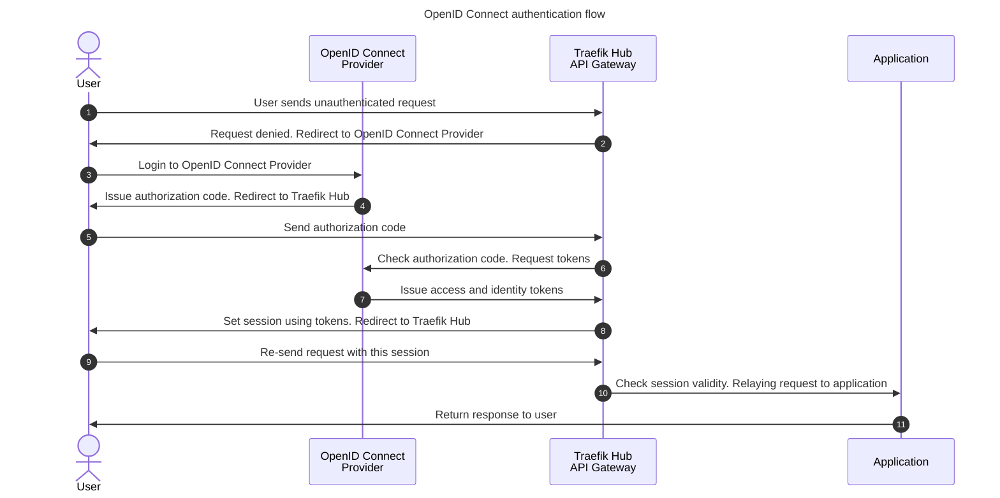

## Human authentication with OpenID Connect Authentication

OpenID Connect Authentication is built on top of the OAuth2 Authorization Code Flow (defined in [OAuth 2.0 RFC 6749, section 4.1](https://tools.ietf.org/html/rfc6749#section-4.1)) and allows an application to be secured by delegating authentication to an external provider (Google Accounts, LinkedIn, GitHub, etc.) and obtaining the end user's session claims and scopes for authorization purposes.

:information_source: To follow this tutorial, you'll need to install Traefik Hub following [getting started](../1-getting-started/README.md) instructions.

Now that Traefik Hub is deployed, let's see how it works:



In this tutorial, we will use [Ory Hydra](https://www.ory.sh/hydra/), an OAuth 2 and OpenID Connect server. We will also use a simple [login/consent app](https://github.com/jlevesy/hail-hydra) that always says yes.

We can deploy it:

```shell
kubectl apply -f api-gateway/2-secure-applications/manifests/hydra.yaml
kubectl wait -n hydra --for=condition=ready pod --selector=app=hydra --timeout=90s
kubectl wait -n hydra --for=condition=ready pod --selector=app=consent --timeout=90s
```

TraefikLabs has open-sourced a simple whoami application displaying technical information about the request.

First, let's deploy and expose it:

```shell
kubectl apply -f src/manifests/whoami-app.yaml
kubectl apply -f src/manifests/whoami-app-ingressroute.yaml
sleep 5
```

```shell
namespace/apps created
deployment.apps/whoami created
service/whoami created
ingressroute.traefik.io/whoami
```

It should be accessible with curl on http://whoami.docker.localhost/

```shell
curl http://whoami.docker.localhost/
```

```shell
Hostname: whoami-697f8c6cbc-8wqq8
IP: 127.0.0.1
IP: ::1
IP: 10.244.0.9
IP: fe80::7c41:ceff:fe38:23e7
RemoteAddr: 10.244.0.10:41222
GET / HTTP/1.1
Host: whoami.docker.localhost
User-Agent: curl/7.88.1
Accept: */*
Accept-Encoding: gzip
X-Forwarded-For: 10.244.0.1
X-Forwarded-Host: whoami.docker.localhost
X-Forwarded-Port: 80
X-Forwarded-Proto: http
X-Forwarded-Server: traefik-hub-54fc878695-8r696
X-Real-Ip: 10.244.0.1
```

To secure it with OIDC, we'll need to configure Hydra.

First, we will create the [JSON Web Key Sets](https://www.ory.sh/docs/hydra/jwks) that hydra uses to sign and verify id-token and access-token:

```shell
kubectl exec -it -n hydra deploy/hydra -- hydra create jwks hydra.openid.id-token --alg RS256 --endpoint http://127.0.0.1:4445/
kubectl exec -it -n hydra deploy/hydra -- hydra create jwks hydra.jwt.access-token --alg RS256 --endpoint http://127.0.0.1:4445/
```

And after, we can use the OIDC middleware. Let's see how it works compared to an unprotected IngressRoute:

```diff
diff -Nau src/manifests/whoami-app-ingressroute.yaml api-gateway/2-secure-applications/manifests/whoami-app-oidc.yaml
--- src/manifests/whoami-app-ingressroute.yaml
+++ api-gateway/2-secure-applications/manifests/whoami-app-oidc.yaml
@@ -1,5 +1,24 @@
 ---
 apiVersion: traefik.io/v1alpha1
+kind: Middleware
+metadata:
+  name: oidc
+  namespace: apps
+spec:
+  plugin:
+    oidc:
+      issuer: http://hydra.hydra.svc:4444
+      clientID: $CLIENT_ID
+      clientSecret: $CLIENT_SECRET
+      loginUrl: /login
+      logoutUrl: /logout
+      redirectUrl: /callback
+      csrf: {}
+      session:
+        name: "oidc-session"
+
+---
+apiVersion: traefik.io/v1alpha1
 kind: IngressRoute
 metadata:
   name: whoami
@@ -13,3 +32,5 @@
     services:
     - name: whoami
       port: 80
+    middlewares:
+    - name: oidc
```

This middleware is configured to redirect `/login`, `/logout`, and `/callback` paths to the OIDC provider.

So let's apply it. We'll create a user in Hydra and set it to the OIDC middleware:

```shell
client=$(kubectl exec -it -n hydra deploy/hydra -- \
  hydra create oauth2-client --name oidc-client --secret traefiklabs \
    --grant-type authorization_code,refresh_token --response-type code,id_token \
    --scope openid,offline --redirect-uri http://whoami.docker.localhost/callback \
    --post-logout-callback http://whoami.docker.localhost/callback \
    --endpoint http://127.0.0.1:4445/ --format json)
sleep 5
export CLIENT_ID=$(echo $client | jq -r '.client_id')
export CLIENT_SECRET=$(echo $client | jq -r '.client_secret')
cat api-gateway/2-secure-applications/manifests/whoami-app-oidc.yaml | envsubst | kubectl apply -f -
```

Let's test it:

```shell
# Protected with OIDC => 401
curl -I http://whoami.docker.localhost
# Let's login and follow the request flow => 204
rm -f /tmp/cookie
curl -v -L -b /tmp/cookie -c /tmp/cookie http://whoami.docker.localhost/login
# Now, with this cookie, we can access => 200
curl -b /tmp/cookie -c /tmp/cookie http://whoami.docker.localhost/
```

Now, let's say we want the user to log in on the whole domain. This YAML should do the trick:

```diff
diff -Nau api-gateway/2-secure-applications/manifests/whoami-app-oidc.yaml api-gateway/2-secure-applications/manifests/whoami-app-oidc-nologinurl.yaml
--- api-gateway/2-secure-applications/manifests/whoami-app-oidc.yaml
+++ api-gateway/2-secure-applications/manifests/whoami-app-oidc-nologinurl.yaml
@@ -10,7 +10,6 @@
       issuer: http://hydra.hydra.svc:4444
       clientID: $CLIENT_ID
       clientSecret: $CLIENT_SECRET
-      loginUrl: /login
       logoutUrl: /logout
       redirectUrl: /callback
       csrf: {}
```

Let's create a new ClientID / ClientSecret pair and test it:

```shell
client=$(kubectl exec -it -n hydra deploy/hydra -- \
  hydra create oauth2-client --name oidc-client --secret traefiklabs \
    --grant-type authorization_code,refresh_token --response-type code,id_token \
    --scope openid,offline --redirect-uri http://whoami.docker.localhost/callback \
    --post-logout-callback http://whoami.docker.localhost/callback \
    --endpoint http://127.0.0.1:4445/ --format json)
sleep 5
export CLIENT_ID=$(echo $client | jq -r '.client_id')
export CLIENT_SECRET=$(echo $client | jq -r '.client_secret')
cat api-gateway/2-secure-applications/manifests/whoami-app-oidc-nologinurl.yaml | envsubst | kubectl apply -f -
```

We can now test it:

```shell
# First time, it will login:
rm -f /tmp/cookie
curl -v -L -b /tmp/cookie -c /tmp/cookie http://whoami.docker.localhost
# Second time, it will re-use the cookie:
curl -b /tmp/cookie -c /tmp/cookie http://whoami.docker.localhost/
```
