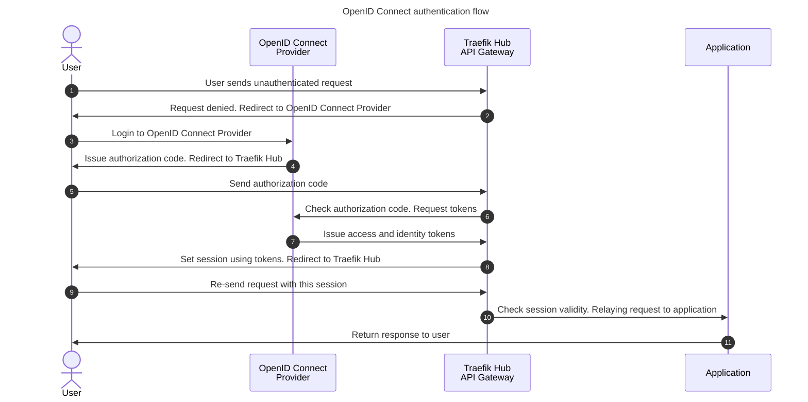

## Human authentication with OpenID Connect Authentication

OpenID Connect Authentication is built on top of the OAuth2 Authorization Code Flow (defined in [OAuth 2.0 RFC 6749, section 4.1](https://tools.ietf.org/html/rfc6749#section-4.1))
and allows an application to be secured by delegating authentication to an external provider (Google Accounts, LinkedIn, GitHub, etc.)
and obtaining the end user's session claims and scopes for authorization purposes.

:information_source: To follow this tutorial, you'll need to install Traefik Hub following [getting started](../1-getting-started/README.md) instructions.

Now that Traefik Hub is deployed, let's see how it works:



In this tutorial, we will use [Ory Hydra](https://www.ory.sh/hydra/), an OAuth 2 and OpenID Connect server. We will also use a simple [login/consent app](https://github.com/jlevesy/hail-hydra) that always says yes.

We can deploy it:

```shell
kubectl apply -f src/manifests/apps-namespace.yaml
kubectl apply -f src/manifests/hydra.yaml
kubectl wait -n hydra --for=condition=ready pod --selector=app=hydra --timeout=90s
kubectl wait -n hydra --for=condition=ready pod --selector=app=consent --timeout=90s
kubectl wait -n hydra --for=condition=complete  job/create-hydra-clients --timeout=90s
```

TraefikLabs has open-sourced a simple whoami application displaying technical information about the request.

First, let's deploy and expose it:

```shell
kubectl apply -f src/manifests/whoami-app.yaml
kubectl apply -f api-gateway/3-secure-applications/manifests/whoami-app-ingressroute.yaml
sleep 5
```

```shell
namespace/apps unchanged
deployment.apps/whoami unchanged
service/whoami unchanged
ingressroute.traefik.io/secure-applications-apigateway-no-auth unchanged
```

It should be accessible with curl on http://secure-applications.apigateway.docker.localhost/no-auth

```shell
curl http://secure-applications.apigateway.docker.localhost/no-auth
```

```shell
Hostname: whoami-6f57d5d6b5-bgmfl
IP: 127.0.0.1
IP: ::1
IP: 10.42.0.10
IP: fe80::c8f6:84ff:fe66:3158
RemoteAddr: 10.42.0.6:52926
GET /no-auth HTTP/1.1
Host: secure-applications.apigateway.docker.localhost
User-Agent: curl/8.5.0
Accept: */*
Accept-Encoding: gzip
X-Forwarded-For: 10.42.0.1
X-Forwarded-Host: secure-applications.apigateway.docker.localhost
X-Forwarded-Port: 80
X-Forwarded-Proto: http
X-Forwarded-Server: traefik-hub-6f5bbd6568-rp882
X-Real-Ip: 10.42.0.1
```

To secure it with OIDC, we'll need to configure Hydra.

First, we can create the [JSON Web Key Sets](https://www.ory.sh/docs/hydra/jwks) that hydra uses to sign and verify id-token and access-token.
This step is automated for you in this tutorial but here is how it's created:

```shell :../../src/manifests/hydra.yaml -s 398 -e 399 -i s1
hydra create jwks hydra.openid.id-token --alg RS256 --endpoint http://hydra.hydra.svc:4445
hydra create jwks hydra.jwt.access-token --alg RS256 --endpoint http://hydra.hydra.svc:4445
```

If needed, it can be run manually with `kubectl exec -it -n hydra deploy/hydra -- hydra create ...`.

And after, we can use the OIDC middleware. Let's see how it works compared to an unprotected IngressRoute:

```diff :../../hack/diff.sh -r -a "manifests/whoami-app-ingressroute.yaml manifests/whoami-app-oidc.yaml"
--- manifests/whoami-app-ingressroute.yaml
+++ manifests/whoami-app-oidc.yaml
@@ -1,15 +1,36 @@
 ---
 apiVersion: traefik.io/v1alpha1
+kind: Middleware
+metadata:
+  name: oidc-login
+  namespace: apps
+spec:
+  plugin:
+    oidc:
+      issuer: http://hydra.hydra.svc:4444
+      clientId: "urn:k8s:secret:oidc-client:client_id"
+      clientSecret: "urn:k8s:secret:oidc-client:client_secret"
+      loginUrl: /oidc/login
+      logoutUrl: /oidc/logout
+      redirectUrl: /oidc/callback
+      csrf: {}
+      session:
+        name: "oidc-session"
+
+---
+apiVersion: traefik.io/v1alpha1
 kind: IngressRoute
 metadata:
-  name: secure-applications-apigateway-no-auth
+  name: secure-applications-apigateway-whoami-oidc
   namespace: apps
 spec:
   entryPoints:
     - web
   routes:
-  - match: Host(`secure-applications.apigateway.docker.localhost`) && Path(`/no-auth`)
+  - match: Host(`secure-applications.apigateway.docker.localhost`) && (Path(`/oidc`) || Path(`/oidc/login`) || Path(`/oidc/logout`) || Path(`/oidc/callback`))
     kind: Rule
     services:
     - name: whoami
       port: 80
+    middlewares:
+    - name: oidc-login
```

This middleware is configured to redirect `/login`, `/logout`, and `/callback` paths to the OIDC provider.

We'll use another user in Hydra for that purpose and set it to the OIDC middleware.
It has been created thise way:

```shell :../../src/manifests/hydra.yaml -s 376 -e 385 -i s1
hydra create oauth2-client \
  --endpoint http://hydra.hydra.svc:4445 \
  --name oidc-client \
  --secret traefiklabs \
  --grant-type authorization_code,refresh_token \
  --response-type code,id_token \
  --scope openid,offline \
  --redirect-uri http://secure-applications.apigateway.docker.localhost/oidc/callback \
  --post-logout-callback http://secure-applications.apigateway.docker.localhost/oidc/callback \
  --format json > /data/oidc-client.json
```

So let's apply it:

```shell
kubectl apply -f api-gateway/3-secure-applications/manifests/whoami-app-oidc.yaml
```

Let's test it:

```shell
# Protected with OIDC => 401
curl -I http://secure-applications.apigateway.docker.localhost/oidc
# Let's login and follow the request flow => 204
rm -f /tmp/cookie
curl -i -L -b /tmp/cookie -c /tmp/cookie http://secure-applications.apigateway.docker.localhost/oidc/login
# Now, with this cookie, we can access => 200
curl -b /tmp/cookie -c /tmp/cookie http://secure-applications.apigateway.docker.localhost/oidc
```

Now, let's say we want the user to log in on the whole domain. This YAML should do the trick:

```diff :../../hack/diff.sh -r -a "manifests/whoami-app-oidc.yaml manifests/whoami-app-oidc-nologinurl.yaml"
--- manifests/whoami-app-oidc.yaml
+++ manifests/whoami-app-oidc-nologinurl.yaml
@@ -2,17 +2,16 @@
 apiVersion: traefik.io/v1alpha1
 kind: Middleware
 metadata:
-  name: oidc-login
+  name: oidc-nologin
   namespace: apps
 spec:
   plugin:
     oidc:
       issuer: http://hydra.hydra.svc:4444
-      clientId: "urn:k8s:secret:oidc-client:client_id"
-      clientSecret: "urn:k8s:secret:oidc-client:client_secret"
-      loginUrl: /oidc/login
-      logoutUrl: /oidc/logout
-      redirectUrl: /oidc/callback
+      clientId: "urn:k8s:secret:oidc-client-nologin:client_id"
+      clientSecret: "urn:k8s:secret:oidc-client-nologin:client_secret"
+      logoutUrl: /oidc-nologin/logout
+      redirectUrl: /oidc-nologin/callback
       csrf: {}
       session:
         name: "oidc-session"
@@ -21,16 +20,16 @@
 apiVersion: traefik.io/v1alpha1
 kind: IngressRoute
 metadata:
-  name: secure-applications-apigateway-whoami-oidc
+  name: secure-applications-apigateway-whoami-nologin
   namespace: apps
 spec:
   entryPoints:
     - web
   routes:
-  - match: Host(`secure-applications.apigateway.docker.localhost`) && (Path(`/oidc`) || Path(`/oidc/login`) || Path(`/oidc/logout`) || Path(`/oidc/callback`))
+  - match: Host(`secure-applications.apigateway.docker.localhost`) && (Path(`/oidc-nologin`) || Path(`/oidc-nologin/logout`) || Path(`/oidc-nologin/callback`))
     kind: Rule
     services:
     - name: whoami
       port: 80
     middlewares:
-    - name: oidc-login
+    - name: oidc-nologin
```

A new ClientID / ClientSecret pair has been created for that purpose:

```shell :../../src/manifests/hydra.yaml -s 387 -e 396 -i s1
hydra create oauth2-client \
  --endpoint http://hydra.hydra.svc:4445 \
  --name oidc-client-nologin \
  --secret traefiklabs \
  --grant-type authorization_code,refresh_token \
  --response-type code,id_token \
  --scope openid,offline \
  --redirect-uri http://secure-applications.apigateway.docker.localhost/oidc-nologin/callback \
  --post-logout-callback http://secure-applications.apigateway.docker.localhost/oidc/callback \
  --format json > /data/oidc-client-nologin.json
```

Now, test it:

```shell
kubectl apply -f api-gateway/3-secure-applications/manifests/whoami-app-oidc-nologinurl.yaml
```

We can now test it:

```shell
# First time, it will login:
rm -f /tmp/cookie
curl -L -b /tmp/cookie -c /tmp/cookie http://secure-applications.apigateway.docker.localhost/oidc-nologin
# Second time, it will re-use the cookie:
curl -b /tmp/cookie -c /tmp/cookie http://secure-applications.apigateway.docker.localhost/oidc-nologin
```
