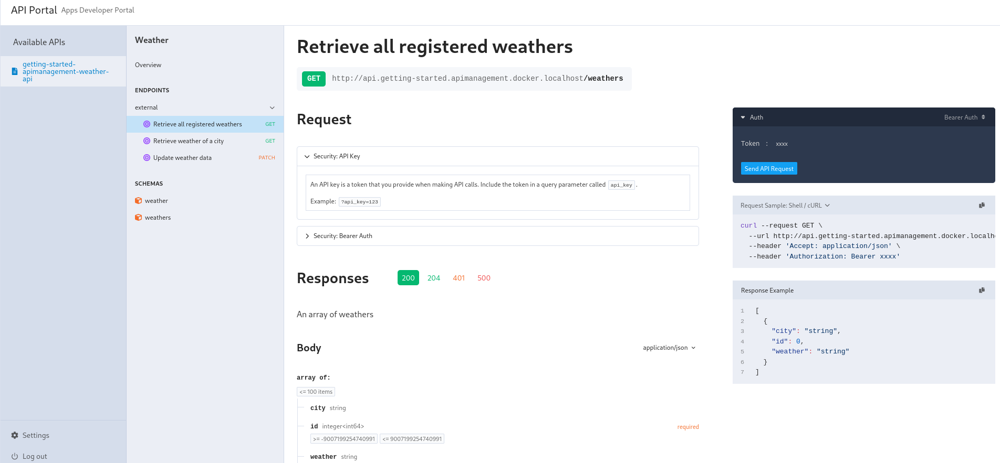

# Getting Started

For this tutorial, we deploy Traefik Hub API Gateway on a [k3d](https://k3d.io/) cluster. It's possible to use alternatives such as [kind](https://kind.sigs.k8s.io), cloud providers, and others.

First, clone the GitHub repository dedicated to tutorials:

```shell
git clone https://github.com/traefik/hub.git
cd hub
```

## Deploy Kubernetes

### Using k3d

```shell
k3d cluster create traefik-hub --port 80:80@loadbalancer --port 443:443@loadbalancer --port 8000:8000@loadbalancer --k3s-arg "--disable=traefik@server:0"
```

### Using Kind

kind requires some configuration to use an IngressController on localhost. See the following example:

<details>

<summary>Create the cluster</summary>

Ports need to be mapped for HTTP and HTTPS for kind with this config:

```yaml
kind: Cluster
apiVersion: kind.x-k8s.io/v1alpha4
name: traefik-hub
nodes:
- role: control-plane
  extraPortMappings:
  - containerPort: 30000
    hostPort: 80
    protocol: TCP
  - containerPort: 30001
    hostPort: 443
    protocol: TCP
```

```shell
kind create cluster --config=src/kind/config.yaml
kubectl cluster-info
kubectl wait --for=condition=ready nodes traefik-hub-control-plane
```

Now, add a load balancer (LB) to it:

```shell
kubectl apply -f src/kind/metallb-native.yaml
kubectl wait --namespace metallb-system --for=condition=ready pod --selector=app=metallb --timeout=90s
kubectl apply -f src/kind/metallb-config.yaml
```

</details>

## Step 1: Install Traefik Hub

First, log in to the [Traefik Hub Online Dashboard](https://hub.traefik.io) and open the page to [create a new gateway](https://hub.traefik.io/gateways/new).

**:warning: Do not install the gateway, but copy the token.**

Then, open a terminal and run these commands to create the required secret:

```shell
export TRAEFIK_HUB_TOKEN=
```

```shell
kubectl create namespace traefik
kubectl create secret generic license --namespace traefik --from-literal=token=$TRAEFIK_HUB_TOKEN
```

Now, install Traefik Hub with Helm:

```shell
# Add the Helm repository
helm repo add --force-update traefik https://traefik.github.io/charts
# Install the Helm chart
helm install traefik-hub -n traefik --wait \
  --set hub.token=license \
  --set hub.apimanagement.enabled=true \
  --set ingressClass.enabled=false \
  --set ingressRoute.dashboard.enabled=true \
  --set ingressRoute.dashboard.matchRule='Host(`dashboard.docker.localhost`)' \
  --set ingressRoute.dashboard.entryPoints={web} \
  --set image.registry=ghcr.io \
  --set image.repository=traefik/traefik-hub \
  --set image.tag=v3.2.0 \
  --set ports.web.nodePort=30000 \
  --set ports.websecure.nodePort=30001 \
   traefik/traefik
```

**If** Traefik Hub is **already** installed, we can instead upgrade the Traefik Hub instance:

```shell
# Upgrade CRDs
kubectl apply --server-side --force-conflicts -k https://github.com/traefik/traefik-helm-chart/traefik/crds/
# Update the Helm repository
helm repo add --force-update traefik https://traefik.github.io/charts
# Upgrade the Helm chart
helm upgrade traefik-hub -n traefik --wait \
  --set hub.token=license \
  --set hub.apimanagement.enabled=true \
  --set ingressClass.enabled=false \
  --set ingressRoute.dashboard.enabled=true \
  --set ingressRoute.dashboard.matchRule='Host(`dashboard.docker.localhost`)' \
  --set ingressRoute.dashboard.entryPoints={web} \
  --set image.registry=ghcr.io \
  --set image.repository=traefik/traefik-hub \
  --set image.tag=v3.2.0 \
  --set ports.web.nodePort=30000 \
  --set ports.websecure.nodePort=30001 \
   traefik/traefik
```

Now, we can access the local dashboard at http://dashboard.docker.localhost/.

## Step 2: Deploy an API as an Ingress

:information_source: This tutorial implements API using a JSON server in Go; check out the source code [here](https://github.com/traefik/hub/tree/main/src/api-server/).

First, let's deploy a [weather app](https://github.com/traefik/hub/blob/main/src/manifests/weather-app.yaml) exposing an API:

```shell
kubectl apply -f src/manifests/apps-namespace.yaml
kubectl apply -f src/manifests/weather-app.yaml
```

It creates the weather app:

```shell
namespace/apps unchanged
configmap/weather-data unchanged
deployment.apps/weather-app unchanged
service/weather-app unchanged
configmap/weather-app-openapispec unchanged
```

Then, expose the weather app using an `IngressRoute`:

```yaml :manifests/weather-app-ingressroute.yaml
---
apiVersion: traefik.io/v1alpha1
kind: IngressRoute
metadata:
  name: getting-started-apimanagement
  namespace: apps
spec:
  entryPoints:
    - web
  routes:
  - match: Host(`getting-started.apimanagement.docker.localhost`)
    kind: Rule
    services:
    - name: weather-app
      port: 3000
```

```shell
kubectl apply -f api-management/1-getting-started/manifests/weather-app-ingressroute.yaml
```

```shell
ingressroute.traefik.io/getting-started-apimanagement created
```

At this moment, this API is exposed. It's possible to reach it using `curl` command:

```shell
curl http://getting-started.apimanagement.docker.localhost
```

```json
{
  "public": [
    { "id": 1, "city": "GopherCity", "weather": "Moderate rain" },
    { "id": 2, "city": "City of Gophers", "weather": "Sunny" },
    { "id": 3, "city": "GopherRocks", "weather": "Cloudy" }
  ]
}
```

## Step 3: Manage the API using Traefik Hub API Management

Let's manage the weather API with Traefik Hub using `API` and `APIAccess` resources:

```yaml :manifests/api.yaml -s 1 -e 23
---
apiVersion: hub.traefik.io/v1alpha1
kind: API
metadata:
  name: getting-started-apimanagement-weather-api
  namespace: apps
spec:
  openApiSpec:
    path: /openapi.yaml
    override:
      servers:
        - url: http://api.getting-started.apimanagement.docker.localhost

---
apiVersion: hub.traefik.io/v1alpha1
kind: APIAccess
metadata:
  name: getting-started-apimanagement-weather-api
  namespace: apps
spec:
  apis:
  - name: getting-started-apimanagement-weather-api
  everyone: true
```

First, reference the `API` in the `IngressRoute` using the dedicated annotation:

```yaml :manifests/api.yaml -s 25 -e 41
---
apiVersion: traefik.io/v1alpha1
kind: IngressRoute
metadata:
  name: getting-started-apimanagement-weather-api
  namespace: apps
  annotations:
    hub.traefik.io/api: getting-started-apimanagement-weather-api # <=== Link to the API using its name
spec:
  entryPoints:
  - web
  routes:
  - match: Host(`api.getting-started.apimanagement.docker.localhost`) && PathRegexp(`^/weather(/([0-9]+|openapi.yaml))?$`)
    kind: Rule
    services:
    - name: weather-app
      port: 3000
```

Now, we can apply the above resources:

```shell
kubectl apply -f api-management/1-getting-started/manifests/api.yaml
```

It creates `API`, `APIAccess`, and links `IngressRoute` to the weather API:

```shell
api.hub.traefik.io/getting-started-apimanagement-weather-api created
apiaccess.hub.traefik.io/getting-started-apimanagement-weather-api created
ingressroute.traefik.io/getting-started-apimanagement-weather-api created
```

Now, the API is secured. When someone tries to access the API, it returns the expected `401 Unauthorized` HTTP code:

```shell
curl -i http://api.getting-started.apimanagement.docker.localhost/weather
```

```shell
HTTP/1.1 401 Unauthorized
Date: Mon, 06 May 2024 12:09:56 GMT
Content-Length: 0
```

## Step 4: Create a user for this API

We can create a user in the [Traefik Hub Online Dashboard](https://hub.traefik.io/users):


We can provide an API Portal to this user.

## Step 5: Deploy the API Portal

An API Portal use the same logic as an API for the routing, using `Ingress` and dedicated annotation.

:information_source: The portal enforces namespace boundaries and considers only `APIAccess` resources within the same namespace as the `APIPortal`.

```yaml :manifests/api-portal.yaml
---
apiVersion: hub.traefik.io/v1alpha1
kind: APIPortal
metadata:
  name: getting-started-apimanagement-apiportal
  namespace: apps
spec:
  title: API Portal
  description: "Apps Developer Portal"
  trustedUrls:
    - http://api.getting-started.apimanagement.docker.localhost

---
apiVersion: networking.k8s.io/v1
kind: Ingress
metadata:
  name: getting-started-apimanagement-apiportal
  namespace: traefik
  annotations:
    # This annotation link this Ingress to the API Portal using <name>@<namespace> format.
    hub.traefik.io/api-portal: getting-started-apimanagement-apiportal@apps
spec:
  rules:
  - host: api.getting-started.apimanagement.docker.localhost
    http:
      paths:
        - path: /
          pathType: Prefix
          backend:
            service:
              name: apiportal
              port:
                number: 9903
```

:information_source: This API Portal is routed with the internal _ClusterIP_ `Service` named _apiportal_ provided with the Helm Chart.

```shell
kubectl apply -f api-management/1-getting-started/manifests/api-portal.yaml
sleep 30
```

```shell
apiportal.hub.traefik.io/getting-started-apimanagement-apiportal created
ingress.networking.k8s.io/getting-started-apimanagement-apiportal created
```

The API Portal is reachable on http://api.getting-started.apimanagement.docker.localhost.

Now, we should be able to log in with the admin user and create a token for the user:


```shell
export ADMIN_TOKEN=
```

The weather API is reachable with this token set as header :tada: :

```shell
curl -H "Authorization: Bearer $ADMIN_TOKEN" http://api.getting-started.apimanagement.docker.localhost/weather
```

```json
{
  "public": [
    { "id": 1, "city": "GopherCity", "weather": "Moderate rain" },
    { "id": 2, "city": "City of Gophers", "weather": "Sunny" },
    { "id": 3, "city": "GopherRocks", "weather": "Cloudy" }
  ]
}
```

:information_source: If it fails with 401, wait a minute and try again. The token needs to be sync before it can be accepted by Traefik Hub.

We can see the API available in the `apps` namespace in the portal. We advise every API to come with an OpenAPI specification (OAS):



However, it's still possible not setting an OAS, but it severely hurts getting started with API consumption.
Let's deploy a [forecast app](https://github.com/traefik/hub/blob/main/src/manifests/weather-app-forecast.yaml) without an OpenAPI specification:

```shell
kubectl apply -f src/manifests/weather-app-forecast.yaml
```

This time, we will specify how to get this openapi spec in API _CRD_:

```yaml :manifests/forecast.yaml -s 1 -e 7
---
apiVersion: hub.traefik.io/v1alpha1
kind: API
metadata:
  name: getting-started-apimanagement-weather-api-forecast
  namespace: apps
spec: {}
```

The other resources are built on the same model, as we can see in [the complete file](https://github.com/traefik/hub/blob/main/api-management/1-getting-started/manifests/forecast.yaml). Let's apply it:

```shell
kubectl apply -f api-management/1-getting-started/manifests/forecast.yaml
```

```shell
api.hub.traefik.io/getting-started-apimanagement-weather-api-forecast created
apiaccess.hub.traefik.io/getting-started-apimanagement-weather-api-forecast created
ingressroute.traefik.io/getting-started-apimanagement-weather-api-forecast created
```

And that's it! This time, we have documentation built from the OpenAPI specification, and we can also interactively try the API with the Try Out functionality.


