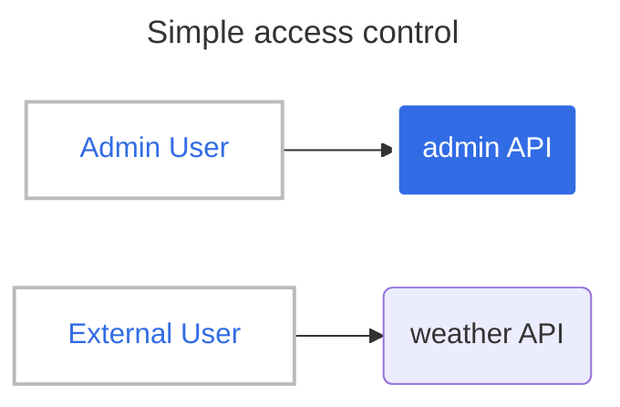
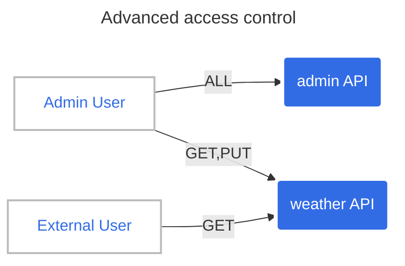

# Access Control

In this tutorial, we will see how to control access to APIs.

## Simple access control

Let's try a simple example start. Let's say we want to give separate access between an (internal) admin user and an external user with a subscription.



First, we will deploy the _weather_ app and the _admin_ app:

```shell
kubectl apply -f src/manifests/apps-namespace.yaml
kubectl apply -f src/manifests/weather-app.yaml
kubectl apply -f src/manifests/admin-app.yaml
```

To ensure isolation between access, there is a versatile `APIAccess` CRD, allowing the linking of user groups and APIs. So, let's declare the _admin_ API with its `APIAccess`:

```yaml :manifests/simple-admin-api.yaml
---
apiVersion: hub.traefik.io/v1alpha1
kind: API
metadata:
  name: access-control-apimanagement-simple-admin
  namespace: admin
spec: {}

---
apiVersion: hub.traefik.io/v1alpha1
kind: APIAccess
metadata:
  name: access-control-apimanagement-simple-admin
  namespace: admin
spec:
  groups: # <=== Allow access only for this group
    - admin
  apis: # <=== Select only this API
    - name: access-control-apimanagement-simple-admin

---
apiVersion: traefik.io/v1alpha1
kind: IngressRoute
metadata:
  name: access-control-apimanagement-simple-admin
  namespace: admin
  annotations:
    hub.traefik.io/api: access-control-apimanagement-simple-admin
spec:
  entryPoints:
    - web
  routes:
  - match: Host(`api.access-control.apimanagement.docker.localhost`) && PathPrefix(`/simple/admin`)
    kind: Rule
    services:
    - name: admin-app
      port: 3000
    middlewares:
      - name: stripprefix-admin
```

```shell
kubectl apply -f api-management/2-access-control/manifests/simple-admin-api.yaml
```

```shell
api.hub.traefik.io/access-control-apimanagement-simple-admin created
apiaccess.hub.traefik.io/access-control-apimanagement-simple-admin created
ingressroute.traefik.io/access-control-apimanagement-simple-admin created
```

For the _external_ `API` with its `APIAccess`, we'll see how to use a label selector:

```yaml :manifests/simple-weather-api.yaml
---
apiVersion: hub.traefik.io/v1alpha1
kind: API
metadata:
  name: access-control-apimanagement-simple-weather
  namespace: apps
  labels:
    subscription: standard
spec:
  openApiSpec:
    path: /openapi.yaml

---
apiVersion: hub.traefik.io/v1alpha1
kind: APIAccess
metadata:
  name: access-control-apimanagement-simple-weather
  namespace: apps
spec:
  groups:
    - external
  apiSelector: # <======== Select all APIs with label subscription=external
    matchLabels:
      subscription: standard

---
apiVersion: traefik.io/v1alpha1
kind: IngressRoute
metadata:
  name: access-control-apimanagement-simple-weather
  namespace: apps
  annotations:
    hub.traefik.io/api: access-control-apimanagement-simple-weather
spec:
  entryPoints:
    - web
  routes:
  - match: Host(`api.access-control.apimanagement.docker.localhost`) && PathRegexp(`^/simple/weather(/([0-9]+|openapi.yaml))?$`)
    kind: Rule
    services:
    - name: weather-app
      port: 3000
    middlewares:
      - name: stripprefix-weather
```

```shell
kubectl apply -f api-management/2-access-control/manifests/simple-weather-api.yaml
```

```shell
api.hub.traefik.io/access-control-apimanagement-simple-weather created
apiaccess.hub.traefik.io/access-control-apimanagement-simple-weather created
ingressroute.traefik.io/access-control-apimanagement-simple-weather created
```

### Test it

First, we'll need to create the _admin_ user in the _admin_ group and the _external_ user in the _external_ group, following instructions in [getting started](../1-getting-started/README.md)

Now, we can test it with the users' API tokens.

```shell
export ADMIN_TOKEN=
export EXTERNAL_TOKEN=
```

```shell
# This call is allowed => 200
curl -i -H "Authorization: Bearer $ADMIN_TOKEN" "http://api.access-control.apimanagement.docker.localhost/simple/admin"
# This call is forbidden => 403
curl -i -H "Authorization: Bearer $ADMIN_TOKEN" "http://api.access-control.apimanagement.docker.localhost/simple/weather"
```

```shell
# This call is allowed => 200
curl -i -H "Authorization: Bearer $EXTERNAL_TOKEN" "http://api.access-control.apimanagement.docker.localhost/simple/weather"
# This call is forbidden => 403
curl -i -H "Authorization: Bearer $EXTERNAL_TOKEN" "http://api.access-control.apimanagement.docker.localhost/simple/admin"
```

:information_source: If it fails, just wait one minute and try again. The token needs to be sync before it can be accepted by Traefik Hub.

## Advanced access control

This second example is more complex, but it's also more secure, using Operation Filters.

* _admin_ can get and update weather data on **private-app** and access without restriction on **admin-app**
* _external_ user can only get data on **weather-app**



One needs to define operationSets to configure operationFilters. Here, we'll differentiate **GET** and **PATCH** HTTP methods.

```diff :../../hack/diff.sh -r -a "manifests/simple-weather-api.yaml manifests/complex-weather-api.yaml"
--- manifests/simple-weather-api.yaml
+++ manifests/complex-weather-api.yaml
@@ -2,40 +2,69 @@
 apiVersion: hub.traefik.io/v1alpha1
 kind: API
 metadata:
-  name: access-control-apimanagement-simple-weather
+  name: access-control-apimanagement-complex-weather
   namespace: apps
   labels:
     subscription: standard
 spec:
   openApiSpec:
     path: /openapi.yaml
+    operationSets:
+      - name: get-forecast
+        matchers:
+          - pathPrefix: "/weather"
+            methods: [ "GET" ]
+      - name: patch-forecast
+        matchers:
+          - pathPrefix: "/weather/0"
+            methods: [ "PATCH" ]
 
 ---
 apiVersion: hub.traefik.io/v1alpha1
 kind: APIAccess
 metadata:
-  name: access-control-apimanagement-simple-weather
+  name: access-control-apimanagement-complex-weather-external
   namespace: apps
 spec:
   groups:
     - external
-  apiSelector: # <======== Select all APIs with label subscription=external
+  apiSelector:
     matchLabels:
       subscription: standard
+  operationFilter:
+    include:
+      - get-forecast
+
+---
+apiVersion: hub.traefik.io/v1alpha1
+kind: APIAccess
+metadata:
+  name: access-control-apimanagement-complex-weather-admin
+  namespace: apps
+spec:
+  groups:
+    - admin
+  apiSelector:
+    matchLabels:
+      subscription: standard
+  operationFilter:
+    include:
+      - get-forecast
+      - patch-forecast
 
 ---
 apiVersion: traefik.io/v1alpha1
 kind: IngressRoute
 metadata:
-  name: access-control-apimanagement-simple-weather
+  name: access-control-apimanagement-complex-weather
   namespace: apps
   annotations:
-    hub.traefik.io/api: access-control-apimanagement-simple-weather
+    hub.traefik.io/api: access-control-apimanagement-complex-weather
 spec:
   entryPoints:
     - web
   routes:
-  - match: Host(`api.access-control.apimanagement.docker.localhost`) && PathRegexp(`^/simple/weather(/([0-9]+|openapi.yaml))?$`)
+  - match: Host(`api.access-control.apimanagement.docker.localhost`) && PathRegexp(`^/complex/weather(/([0-9]+|openapi.yaml))?$`)
     kind: Rule
     services:
     - name: weather-app
```

### Deploy and test it

After deploying it:

```shell
kubectl apply -f api-management/2-access-control/manifests/complex-weather-api.yaml
kubectl apply -f api-management/2-access-control/manifests/complex-admin-api.yaml
```

It can be tested with the API token of the admin:

```shell
# This call is allowed.
curl -i -H "Authorization: Bearer $ADMIN_TOKEN" "http://api.access-control.apimanagement.docker.localhost/complex/admin"
# This call is now allowed
curl -i -H "Authorization: Bearer $ADMIN_TOKEN" "http://api.access-control.apimanagement.docker.localhost/complex/weather"
# And even PATCH is allowed
curl -i -XPATCH -H "Authorization: Bearer $ADMIN_TOKEN" "http://api.access-control.apimanagement.docker.localhost/complex/weather/0" -d '[{"op": "replace", "path": "/city", "value": "GopherTown"}]'
```

And test it with the external user's token:

```shell
# This one is allowed
curl -i -H "Authorization: Bearer $EXTERNAL_TOKEN" "http://api.access-control.apimanagement.docker.localhost/complex/weather"
# And PATCH should be not allowed
curl -i -XPATCH -H "Authorization: Bearer $EXTERNAL_TOKEN" "http://api.access-control.apimanagement.docker.localhost/complex/weather/0" -d '[{"op": "replace", "path": "/weather", "value": "Cloudy"}]'
```

It can be explained quite easily if **PATCH** is still allowed. There is still an `APIAccess` created with the simple tutorial:

```yaml
kubectl get apiaccess -n apps
NAME                                                    AGE
getting-started-apimanagement-weather-api               86m
getting-started-apimanagement-weather-api-forecast      9m1s
access-control-apimanagement-simple-weather             6m15s
access-control-apimanagement-complex-weather-external   54s
access-control-apimanagement-complex-weather-admin      54s
```

It means that for the `external` user group, there are two `APIAccess` applying:

This is the first one:

```yaml :manifests/simple-weather-api.yaml -s 13 -e 24
---
apiVersion: hub.traefik.io/v1alpha1
kind: APIAccess
metadata:
  name: access-control-apimanagement-simple-weather
  namespace: apps
spec:
  groups:
    - external
  apiSelector: # <======== Select all APIs with label subscription=external
    matchLabels:
      subscription: standard
```

And this is the second one:

```yaml :manifests/complex-weather-api.yaml -s 22 -e 36
---
apiVersion: hub.traefik.io/v1alpha1
kind: APIAccess
metadata:
  name: access-control-apimanagement-complex-weather-external
  namespace: apps
spec:
  groups:
    - external
  apiSelector:
    matchLabels:
      subscription: standard
  operationFilter:
    include:
      - get-forecast
```

The first one allows all kinds of HTTP requests. If we delete it, the _external_ user can no longer call the API with the **PATCH** HTTP verb.

```shell
kubectl delete apiaccess -n apps access-control-apimanagement-simple-weather
# This time, PATCH is not allowed
curl -i -XPATCH -H "Authorization: Bearer $EXTERNAL_TOKEN" "http://api.access-control.apimanagement.docker.localhost/complex/weather/0" -d '[{"op": "replace", "path": "/weather", "value": "Cloudy"}]'
```
