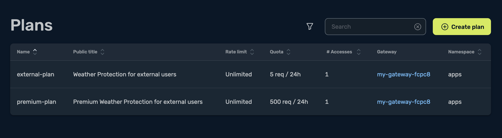
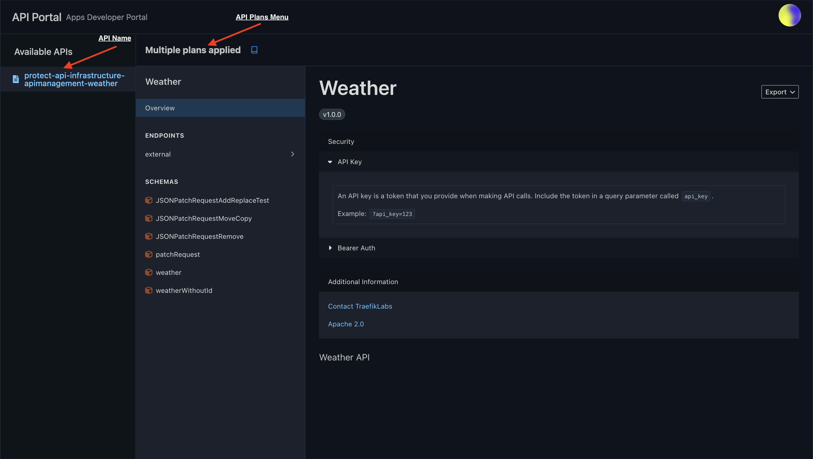
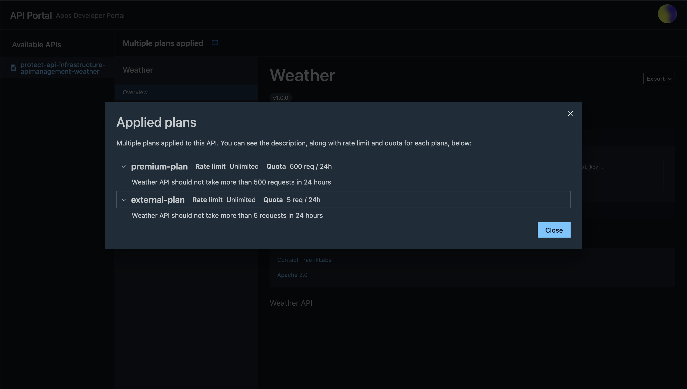

# Protect API infrastructure

In this tutorial, we will learn how to protect our APIs from excessive usage using API Plans in Traefik Hub’s API Management.
By following these steps, we’ll ensure that our APIs remain performant and are not overwhelmed by excessive requests.

By the end of this tutorial, we’ll be able to:

- Protect our APIs from excessive usage by implementing rate limits and quotas using API Plans.
- Manage API Plans to provide different levels of service to various consumer groups.

## What are our APIs ?

In this tutorial, we will use two APIs:

1. `admin` API: It's internal and not really reliable. It should not take more than one request per second
2. `weather` API: It's exposed externally. Users can be billed for this one, up to 500 requests each day.

## Pre-requisites

- Traefik Hub should be installed with API Management following [getting started](../1-getting-started/README.md) instructions
- Follow the [Access Control](../2-access-control/README.md) tutorial to set up the users and API portal we will need in this tutorial

### Step 1: Deploy `weather` and `admin` apps and APIs

First, deploy the weather app and the admin app, with an API Access. It follows the simple access control that is detailed in the [Access Control Tutorial](../2-access-control/README.md).

```sh
kubectl apply -f src/manifests/apps-namespace.yaml
kubectl apply -f src/manifests/weather-app.yaml
kubectl apply -f src/manifests/admin-app.yaml
kubectl wait -n apps --for=condition=ready pod --selector=app=weather-app --timeout=90s
kubectl wait -n admin --for=condition=ready pod --selector=app=admin-app --timeout=90s
kubectl apply -f api-management/4-protect-api-infrastructure/manifests/admin-api.yaml
kubectl apply -f api-management/4-protect-api-infrastructure/manifests/admin-apiaccess.yaml
kubectl apply -f api-management/4-protect-api-infrastructure/manifests/admin-ingressroute.yaml
kubectl apply -f api-management/4-protect-api-infrastructure/manifests/weather-api.yaml
kubectl apply -f api-management/4-protect-api-infrastructure/manifests/weather-apiaccess.yaml
kubectl apply -f api-management/4-protect-api-infrastructure/manifests/weather-ingressroute.yaml
```

### Step 2: Check Access Control

Those two APIs should be deployed with an access control. Let's check that!

You'll need to get the token for the admin user in the admin group and the external user in the external group, following instructions in the [access control](../2-access-control/README.md) tutorial.

```sh
# Set here after "=" the token of admin user
export ADMIN_TOKEN=
# Set here after "=" the token of external user
export EXTERNAL_TOKEN=
```

Admin user is only allowed to access admin API:

```sh
# This call is allowed => 200
curl -sIXGET -H "Authorization: Bearer $ADMIN_TOKEN" "http://api.protect-infrastructure.apimanagement.docker.localhost/admin"
# This call is forbidden => 403
curl -sIXGET -H "Authorization: Bearer $ADMIN_TOKEN" "http://api.protect-infrastructure.apimanagement.docker.localhost/weather"
```

External user is only allowed to access external API:

```sh
# This call is allowed => 200
curl -sIXGET -H "Authorization: Bearer $EXTERNAL_TOKEN" "http://api.protect-infrastructure.apimanagement.docker.localhost/weather"
# This call is forbidden => 403
curl -sIXGET -H "Authorization: Bearer $EXTERNAL_TOKEN" "http://api.protect-infrastructure.apimanagement.docker.localhost/admin"
```

### Step 3: Set up Redis

To use the API plan feature, we need to deploy and configure Redis in your cluster and the Traefik deployment.

We can do that by following the instructions in the [official documentation.](https://doc.traefik.io/traefik-hub/api-management/api-plans#prerequisites)

## Protect from excessive usage

### RateLimit on Admin

In order to set rate limit on an API, we'll need to create an API Plan. This API Plan should be associated with an `APIAccess` resource.

```yaml :manifests/admin-apiplan.yaml
apiVersion: hub.traefik.io/v1alpha1
kind: APIPlan
metadata:
  name: admin
  namespace: admin
spec:
  title: "Admin Protection"
  description: "Admin API should not take more than one request per second."
  rateLimit:
    limit: 1
    period: 1s
```

And link it in the API Access

```diff :../../hack/diff.sh -r -a "manifests/admin-apiaccess.yaml manifests/admin-apiaccess-ratelimit.yaml"
--- manifests/admin-apiaccess.yaml
+++ manifests/admin-apiaccess-ratelimit.yaml
@@ -1,10 +1,12 @@
 apiVersion: hub.traefik.io/v1alpha1
 kind: APIAccess
 metadata:
-  name: protect-api-infrastructure-apimanagement-admin
+  name: protect-api-infrastructure-apimanagement-admin-ratelimit
   namespace: admin
 spec:
   groups:
     - admin
   apis:
     - name: protect-api-infrastructure-apimanagement-admin
+  apiPlan:
+    name: admin
```

Let's apply it:

```shell
kubectl apply -f api-management/4-protect-api-infrastructure/manifests/admin-apiplan.yaml
kubectl apply -f api-management/4-protect-api-infrastructure/manifests/admin-apiaccess-ratelimit.yaml
```

And test it:

```sh
# This call is allowed => 200
curl -sIXGET -H "Authorization: Bearer $ADMIN_TOKEN" "http://api.protect-infrastructure.apimanagement.docker.localhost/admin"
```

```sh
HTTP/1.1 200 OK
Content-Length: 55
Content-Type: text/plain; charset=utf-8
```

:warning: We can see here that the API plan is not working yet because we do not get any HTTP header showing us our Rate Limit remaining as mentioned in the [documentation](https://doc.traefik.io/traefik-hub/api-management/api-plans#response-headers).

Let's try to understand why.

We can check the API Access:

```sh
kubectl get apiaccess -n admin
```

```sh
protect-api-infrastructure-apimanagement-admin             23m
protect-api-infrastructure-apimanagement-admin-ratelimit   98s
```

It seems we have two API Access. When multiple `APIAccess` overlap, the [documentation](https://doc.traefik.io/traefik-hub/api-management/api-plans#managing-overlapping-plans) says:

> If the weights were equal or not set for both APIAccess resources, the system would select the one whose name comes first alphabetically.

So Traefik Hub is using the first one in alphabetical order (`protect-api-infrastructure-apimanagement-admin`), without the `APIPlan`.

Let's see what happens when we delete the first one:

```sh
kubectl delete apiaccess -n admin protect-api-infrastructure-apimanagement-admin
```

Let's test it again:

```sh
# This call is allowed => 200
curl -sIXGET -H "Authorization: Bearer $ADMIN_TOKEN" "http://api.protect-infrastructure.apimanagement.docker.localhost/admin"
```

```sh
HTTP/1.1 200 OK
Content-Length: 55
Content-Type: text/plain; charset=utf-8
X-Ratelimit-Remaining: 0
```

Yeah, it works :tada: ! We can see the HTTP header `X-Ratelimit-Remaining`. Since we have enforced one request per second, there is 0 left. If we do it twice in a row, the second one will be rejected:

```sh
curl -sIXGET -H "Authorization: Bearer $ADMIN_TOKEN" "http://api.protect-infrastructure.apimanagement.docker.localhost/admin"
curl -sIXGET -H "Authorization: Bearer $ADMIN_TOKEN" "http://api.protect-infrastructure.apimanagement.docker.localhost/admin"
```

```sh
HTTP/1.1 200 OK
Content-Length: 55
Content-Type: text/plain; charset=utf-8
X-Ratelimit-Remaining: 0

HTTP/1.1 429 Too Many Requests
X-Ratelimit-Remaining: 0
Content-Length: 0
```

We can see the second one was rejected. Within an application, it can wait for a bit of time before re-trying the request.

Now, let's see how to use quota.

### Quota on external API

In order to set a quota on the weather API that is exposed externally, we'll need to create another API Plan. This API Plan should be associated with an `APIAccess` resource.

> [!NOTE]
> Ratelimit and Quota can also be configured in the same API Plan depending on your use case.

```yaml :manifests/weather-apiplan.yaml
apiVersion: hub.traefik.io/v1alpha1
kind: APIPlan
metadata:
  name: external
  namespace: apps
spec:
  title: "Weather Protection for external users"
  description: "Weather API should not take more than 5 requests in 24 hours"
  quota:
    limit: 5
    period: 24h
```

And link it in the API Access:

```diff :../../hack/diff.sh -r -a "manifests/weather-apiaccess.yaml manifests/weather-apiaccess-quota.yaml"
--- manifests/weather-apiaccess.yaml
+++ manifests/weather-apiaccess-quota.yaml
@@ -1,11 +1,12 @@
----
 apiVersion: hub.traefik.io/v1alpha1
 kind: APIAccess
 metadata:
-  name: protect-api-infrastructure-apimanagement-weather
+  name: protect-api-infrastructure-apimanagement-weather-quota
   namespace: apps
 spec:
   groups:
     - external
   apis:
    - name: protect-api-infrastructure-apimanagement-weather
+  apiPlan:
+    name: external
```

Let's apply it:

```yaml
kubectl apply -f api-management/4-protect-api-infrastructure/manifests/weather-apiplan.yaml
kubectl apply -f api-management/4-protect-api-infrastructure/manifests/weather-apiaccess-quota.yaml
```

And test it:

```sh
# This call is allowed => 200
curl -sIXGET -H "Authorization: Bearer $EXTERNAL_TOKEN" "http://api.protect-infrastructure.apimanagement.docker.localhost/weather"
```

```sh
HTTP/1.1 200 OK
Content-Length: 163
Content-Type: text/plain; charset=utf-8
```

:warning: We can see here that the API plan is not working yet!

Just like we faced when we were applying [rate limiting](#ratelimit-on-admin) on the admin API, we have to delete the first API Access we applied for weather.

```sh
kubectl delete apiaccess -n apps protect-api-infrastructure-apimanagement-weather
```

Let's test it again:

```sh
# This call is allowed => 200
curl -sIXGET -H "Authorization: Bearer $EXTERNAL_TOKEN" "http://api.protect-infrastructure.apimanagement.docker.localhost/weather"
```

```sh
HTTP/1.1 200 OK
Content-Length: 163
Content-Type: text/plain; charset=utf-8
X-Quota-Remaining: 3
```

This time it works and now we can see that there's a new header `X-Quota-Remaining: 3` that specifies our quota.

Now, what happens when we exhaust our quota? Can we still make API requests?

Let's try to exhaust our quota like this:

```sh
for i in {1..6}; do
  curl -sIXGET -H "Authorization: Bearer $EXTERNAL_TOKEN" "http://api.protect-infrastructure.apimanagement.docker.localhost/weather"
done
```

```sh
HTTP/1.1 200 OK
Content-Length: 163
Content-Type: text/plain; charset=utf-8
X-Quota-Remaining: 2

HTTP/1.1 200 OK
Content-Length: 163
Content-Type: text/plain; charset=utf-8
X-Quota-Remaining: 1

HTTP/1.1 200 OK
Content-Length: 163
Content-Type: text/plain; charset=utf-8
X-Quota-Remaining: 0

HTTP/1.1 429 Too Many Requests
X-Quota-Remaining: 0
Content-Length: 0

HTTP/1.1 429 Too Many Requests
X-Quota-Remaining: 0
Content-Length: 0

HTTP/1.1 429 Too Many Requests
X-Quota-Remaining: 0
Content-Length: 0
```

Well, we can see that after we exhaust our quota, we cannot make any more requests to the API, we get a HTTP status code of `429 too many requests`.

We will only be able to make requests again in 24 hours like our API plan specifies or if we subscribe to a new plan.

Why don't we subscribe to a new plan?

Let's create a new API plan called `premium-plan` with a higher quota:

```yaml :manifests/weather-apiplan-premium.yaml
apiVersion: hub.traefik.io/v1alpha1
kind: APIPlan
metadata:
  name: external-premium
  namespace: apps
spec:
  title: "Premium Weather API Plan for external users"
  description: "Weather API should not take more than 500 requests in 24 hours"
  quota:
    limit: 500
    period: 24h
```

And we need to associate this new `APIPlan` with with the same `APIAccess`:

```diff :../../hack/diff.sh -r -a "manifests/weather-apiaccess-quota.yaml manifests/weather-apiaccess-quota-premium.yaml"
--- manifests/weather-apiaccess-quota.yaml
+++ manifests/weather-apiaccess-quota-premium.yaml
@@ -1,3 +1,4 @@
+---
 apiVersion: hub.traefik.io/v1alpha1
 kind: APIAccess
 metadata:
@@ -9,4 +10,4 @@
   apis:
    - name: protect-api-infrastructure-apimanagement-weather
   apiPlan:
-    name: external
+    name: external-premium
```

Let's apply the new `APIPlan` and the updated `APIAccess`:

```sh
kubectl apply -f api-management/4-protect-api-infrastructure/manifests/weather-apiplan-premium.yaml
kubectl apply -f api-management/4-protect-api-infrastructure/manifests/weather-apiaccess-quota-premium.yaml
```

If we make a request again:

```sh
curl -sIXGET -H "Authorization: Bearer $EXTERNAL_TOKEN" "http://api.protect-infrastructure.apimanagement.docker.localhost/weather"
```

We get this output now:

```sh
HTTP/1.1 200 OK
Content-Length: 163
Content-Type: text/plain; charset=utf-8
X-Quota-Remaining: 494
```

Yeah, it works now! :tada:

We can see the HTTP header `X-Quota-Remaining: 494` is present, so our new API Plan is in effect.

Also, If you haven't yet noticed, despite having 500 requests in our new quota, the header says the quota remaining is `494`.
This means that when we applied the new API plan, the system took account of our previously exhausted 5 requests.

### Viewing your API plan in Traefik Hub online dashboard

With our API plans and API Accesses created, if we navigate to the [Traefik Hub Online Dashboard](https://hub-preview.traefik.io/plans), we should see the new API plans listed.



Also, if we navigate to the Apps API Portal we deployed earlier in the [getting started tutorial](../1-getting-started/README.md#step-5-deploy-the-api-portal), we should see the API listed and the API plans available to it.



If you click on **Multiple plans applied**, you should see all the plans we have applied to the `weather` API.



And that's it! In this tutorial, we've:

- Secured access to our exposed APIs by defining access policies using `APIAccess` resources.
- Protected our APIs from excessive usage by implementing rate limits and quotas through `APIPlan` resources.
