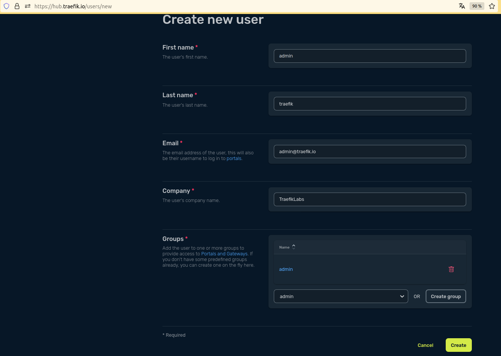
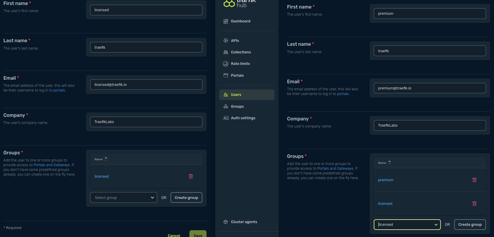

# About

This tutorial details how to deploy locally a Kubernetes cluster and install Traefik Hub agent.

## Deploy Kubernetes

In this tutorial, one can use [k3d](https://k3d.io/). Alternatives like [kind](https://kind.sigs.k8s.io), cloud providers, or others can also be used.

First, clone this GitHub repository:

```shell
git clone https://github.com/traefik/hub.git
cd traefik-hub
```

## Using k3d

```shell
k3d cluster create traefik-hub --port 80:80@loadbalancer --port 443:443@loadbalancer --port 8000:8000@loadbalancer --k3s-arg "--disable=traefik@server:0"
```

## Using Kind

kind requires some configuration to use an IngressController on localhost, see the following example:

```shell
cat kind.config
```

```yaml
kind: Cluster
apiVersion: kind.x-k8s.io/v1alpha4
name: traefik-hub
nodes:
- role: control-plane
  extraPortMappings:
  - containerPort: 30000
    hostPort: 80
    protocol: TCP
  - containerPort: 30001
    hostPort: 443
    protocol: TCP
```

2. Create the Kubernetes cluster:

**Using kind**

Create the cluster:

```shell
kind create cluster --config=tutorials/0-prerequisites/kind/config.yaml
kubectl cluster-info
kubectl wait --for=condition=ready nodes traefik-hub-control-plane
```

Add a load balancer (LB) to this Kubernetes cluster:

```shell
kubectl apply -f tutorials/0-prerequisites/kind/metallb-native.yaml
kubectl wait --namespace metallb-system --for=condition=ready pod --selector=app=metallb --timeout=90s
kubectl apply -f tutorials/0-prerequisites/kind/metallb-config.yaml
```

## Install Traefik Hub

Login to the [Traefik Hub UI](https://hub.traefik.io), open the page to [generate a new agent](https://hub.traefik.io/agents/new).
**Do not install the agent, but copy your token.**

Now, open a terminal and run these commands to create the secret needed for Traefik Hub.

```shell
export TRAEFIK_HUB_TOKEN=xxx
kubectl create namespace traefik-hub
kubectl create secret generic hub-agent-token --namespace traefik-hub --from-literal=token=${TRAEFIK_HUB_TOKEN}
```

After, you can install Traefik Hub with Helm:

```shell

# Add the Helm repository

helm repo add traefik https://traefik.github.io/charts
helm repo update

# Install Traefik Hub

helm upgrade --install --namespace traefik-hub traefik-hub traefik/traefik-hub
```

## Configure Traefik Hub users

Three users are needed for this tutorial:

* `admin` user in `admin` group for internal use API.
* `licensed` user in `licensed` group, which can access a private API, requiring a standard subscription.
* `premium` user in `licensed` and `premium` group, which can access all private APIs, requiring a premium subscription.

<details>
  <summary>Create users in Traefik Hub UI</summary>

Create the `admin` user in the Traefik Hub UI:



Do the same for `licensed` and `premium` user:



</details>

# Clean up

Everything is installed in Kubernetes.
You can delete the Kubernetes cluster with the following command:

```shell
# kind
kind delete cluster --name traefik-hub
```

```shell
# k3d
k3d delete cluster traefik-hub
```

You may also want to delete the users in Traefik Hub UI.
