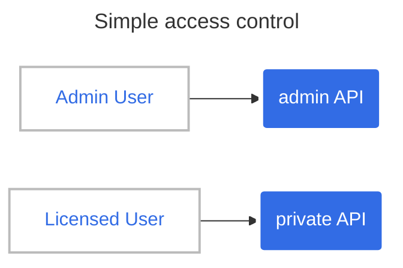
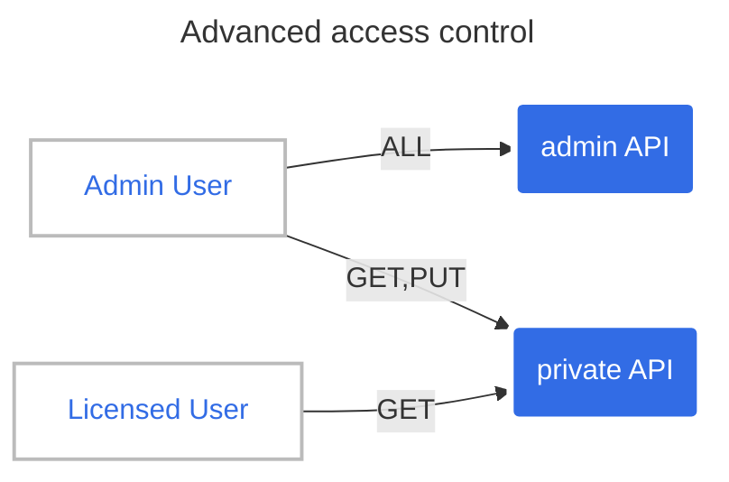

# Access Control

In this tutorial, we will see how to control access on APIs.

## Simple access control

At first, let's try to give and separate access between internal admin user and external user with a subscription.



First, we will deploy the _private_ app and the _admin_ app:

```shell
kubectl apply -f src/manifests/private-app.yaml
kubectl apply -f src/manifests/admin-app.yaml
```

Second, we can declare the API:

```yaml
---
apiVersion: hub.traefik.io/v1alpha1
kind: API
metadata:
  name: licensed-api
  namespace: apps
  labels:
    subscription: standard
spec:
  pathPrefix: "/weather/licensed/forecast"
  service:
    name: private-app
    port:
      number: 3000

---
apiVersion: hub.traefik.io/v1alpha1
kind: API
metadata:
  name: admin-api
  namespace: admin
spec:
  pathPrefix: "/admin"
  service:
    name: admin-app
    port:
      number: 3000
```

```shell
kubectl apply -f tutorials/3-access-control/simple/apis.yaml
```

With those APIs, we will describe access on those APIs:

```yaml
---
apiVersion: hub.traefik.io/v1alpha1
kind: APIAccess
metadata:
  name: admin
spec:
  groups:
    - admin
  apis:
    - name: admin-api
      namespace: admin
---
apiVersion: hub.traefik.io/v1alpha1
kind: APIAccess
metadata:
  name: licensed
spec:
  groups:
    - licensed
  apiSelector:
    matchLabels:
      subscription: standard
```

```shell
kubectl apply -f tutorials/3-access-control/simple/api-accesses.yaml
```

We can reference those access in the Gateway:

```yaml
apiVersion: hub.traefik.io/v1alpha1
kind: APIGateway
metadata:
  name: api-gateway
spec:
  apiAccesses:
    - admin
    - licensed
```

```shell
kubectl apply -f tutorials/3-access-control/simple/api-gateway.yaml
```

### Test it

Now, we can test it with api token of users.

```shell
export API_GATEWAY_URL=$(kubectl get apigateways.hub.traefik.io api-gateway -o template --template '{{ .status.urls }}')
export ADMIN_USER_TOKEN=XXX
# This call is allowed.
curl -H "Authorization: Bearer ${ADMIN_USER_TOKEN}" "${API_GATEWAY_URL}/admin/" -w 'HTTP code: %{http_code}\n'
# This call is unauthorized
curl -H "Authorization: Bearer ${ADMIN_USER_TOKEN}" "${API_GATEWAY_URL}/weather/licensed/forecast" -w 'HTTP code: %{http_code}\n'
```

```shell
export LICENSED_USER_TOKEN=XXX
export API_GATEWAY_URL=$(kubectl get apigateways.hub.traefik.io api-gateway -o template --template '{{ .status.urls }}')
# This one is allowed
curl -H "Authorization: Bearer ${LICENSED_USER_TOKEN}" "${API_GATEWAY_URL}/weather/licensed/forecast/" -w 'HTTP code: %{http_code}\n'
# This one is unauthorized
curl -H "Authorization: Bearer ${LICENSED_USER_TOKEN}" "${API_GATEWAY_URL}/admin" -w 'HTTP code: %{http_code}\n'
```

## Advanced access control

This second example is more complex, it's also more secure, using Operation Filters.

* _admin_ can get and update weather data on **private-app** and access without restriction on **admin-app**
* _licensed_ user can only get data on **weather-app**



One needs to define operationSets in order to configure operationFilters. Here, we'll differentiate **GET** and **PATCH** HTTP method.

```diff
--- simple/apis.yaml    2024-02-27 16:41:51.562761429 +0100
+++ complex/apis.yaml   2024-02-27 15:59:57.415837079 +0100
@@ -14,6 +14,15 @@
       number: 3000
     openApiSpec:
       path: /openapi.yaml
+      operationSets:
+        - name: get-forecast
+          matchers:
+            - pathPrefix: "/forecast"
+              methods: [ "GET" ]
+        - name: patch-forecast
+          matchers:
+            - pathPrefix: "/forecast"
+              methods: [ "PATCH" ]

 ---
 apiVersion: hub.traefik.io/v1alpha1

```

With those operationSets, one can control more precisely what is authorized on APIs:

```diff
--- simple/api-accesses.yaml    2024-02-27 15:39:34.898506945 +0100
+++ complex/api-accesses.yaml   2024-02-27 16:54:39.560481770 +0100
@@ -13,10 +13,28 @@
 apiVersion: hub.traefik.io/v1alpha1
 kind: APIAccess
 metadata:
-  name: licensed
+  name: forecast-admin
+spec:
+  groups:
+    - admin
+  apiSelector:
+    matchLabels:
+      subscription: standard
+  operationFilter:
+    include:
+      - get-forecast
+      - patch-forecast
+---
+apiVersion: hub.traefik.io/v1alpha1
+kind: APIAccess
+metadata:
+  name: forecast-licensed
 spec:
   groups:
     - licensed
   apiSelector:
     matchLabels:
       subscription: standard
+  operationFilter:
+    include:
+      - get-forecast
```

And declares them on the API Gateway:

```diff
--- simple/api-gateway.yaml     2024-02-27 15:39:34.898506945 +0100
+++ complex/api-gateway.yaml    2024-02-27 16:54:51.928422829 +0100
@@ -5,4 +5,5 @@
 spec:
   apiAccesses:
     - admin
-    - licensed
+    - forecast-admin
+    - forecast-licensed
```

### Deploy and test it

After deploying it:

```shell
kubectl apply -f tutorials/3-access-control/complex/
```

It can be tested with API token of admin & licensed users:

```shell
export API_GATEWAY_URL=$(kubectl get apigateways.hub.traefik.io api-gateway -o template --template '{{ .status.urls }}')
export ADMIN_USER_TOKEN=XXX
# This call is allowed.
curl -H "Authorization: Bearer ${ADMIN_USER_TOKEN}" "${API_GATEWAY_URL}/admin/" -w 'HTTP code: %{http_code}\n'
# This call is now allowed
curl -H "Authorization: Bearer ${ADMIN_USER_TOKEN}" "${API_GATEWAY_URL}/weather/licensed/forecast" -w 'HTTP code: %{http_code}\n'
# And even PATCH is allowed
curl -XPATCH -H "Authorization: Bearer ${ADMIN_USER_TOKEN}" "${API_GATEWAY_URL}/weather/licensed/forecast" -w 'HTTP code: %{http_code}\n'
```

```shell
export LICENSED_USER_TOKEN=XXX
export API_GATEWAY_URL=$(kubectl get apigateways.hub.traefik.io api-gateway -o template --template '{{ .status.urls }}')
# This one is allowed
curl -H "Authorization: Bearer ${LICENSED_USER_TOKEN}" "${API_GATEWAY_URL}/weather/licensed/forecast/" -w 'HTTP code: %{http_code}\n'
# And PATCH is not allowed
curl -XPATCH -H "Authorization: Bearer ${LICENSED_USER_TOKEN}" "${API_GATEWAY_URL}/weather/licensed/forecast" -w 'HTTP code: %{http_code}\n'
```
